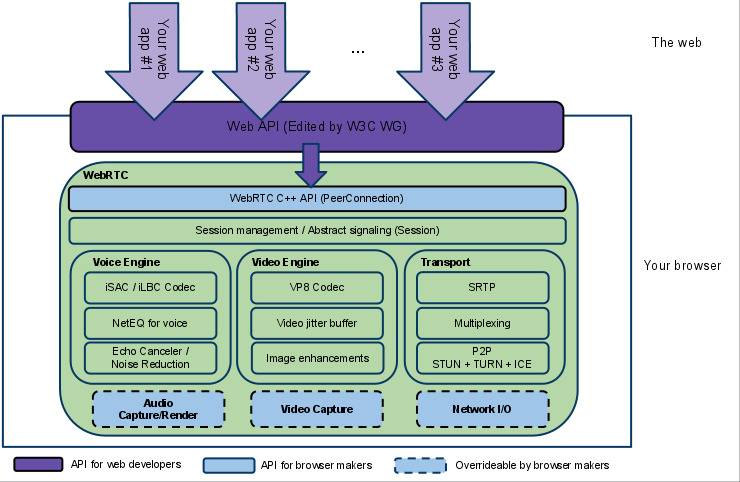
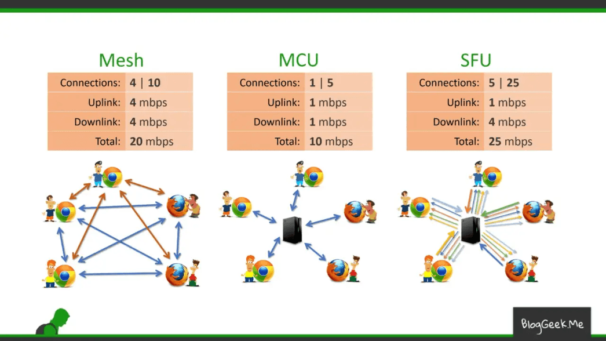
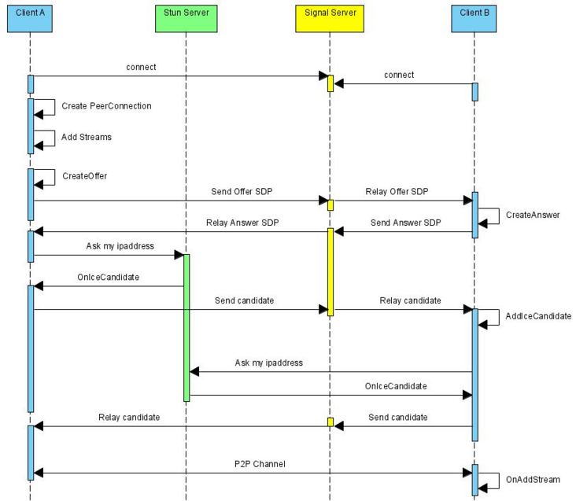

## 架构图

## 不同多人会话服务器方案

|   方案名称   | 方案评价                                | 实现难度 |
|:--------:|:------------------------------------|:----:|
| P2P/Mesh | 点对点的方案, 客户端分发流，性能较差                 |  低   |
|   SFU    | 服务端分发流方案， 技术难度较高，涉及到服务器分发和内网穿透一系列问题 |  高   |
|   MCU    | 服务端合并流方案，技术难度最高，涉及到服务器合并流           |  很高  |

## WebRTC时序图

## 参考链接

[WebRTC解释](https://developer.mozilla.org/zh-CN/docs/Web/API/MediaDevices/getUserMedia)
[WebRTC管网](https://webrtc.github.io/webrtc-org/architecture/)
[WebRTC 实现方法](https://millo-l.github.io/WebRTC-implementation-method-Mesh-SFU-MCU/)
[WebRTC Tutorial: Simple video chat](https://www.scaledrone.com/blog/webrtc-tutorial-simple-video-chat/)
[用WebRTC做一个简单的视频通话](https://webrtc.org.cn/tutorial-simple-video-chat/)
[从0到1打造一个 WebRTC 应用](https://juejin.cn/post/6896045087659130894)
[【从头到脚】撸一个多人视频聊天 — 前端 WebRTC 实战（一）](https://juejin.cn/post/6844903798750576647)
[50行代码完成视频通话 (WebRTC + WebSocket)](https://segmentfault.com/a/1190000020780854)
