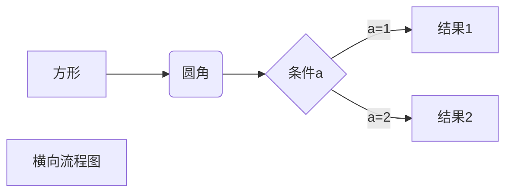
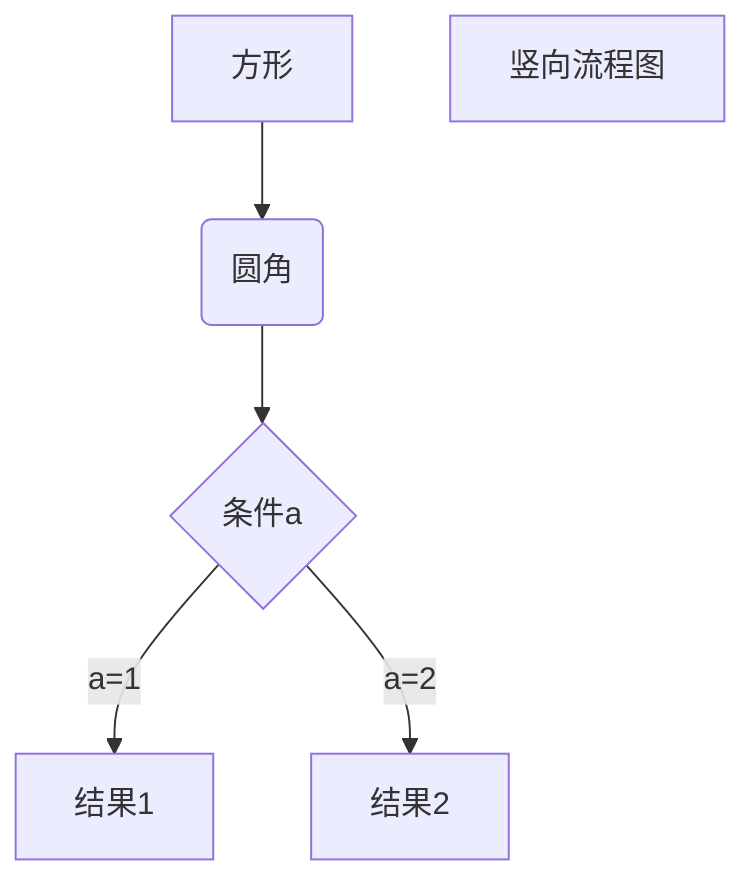
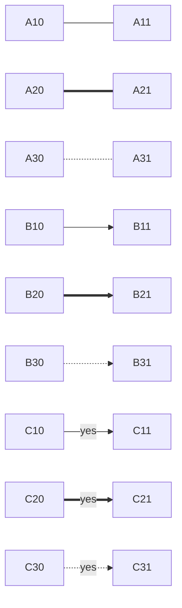
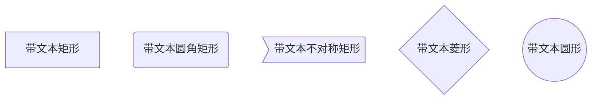

 

## 简单使用

# 一级标题 ’#‘
###### 六级标题 ’######‘

*斜体* ’* *‘

**加粗** ’** **‘

***斜体加粗***  '*** ***'

~~删除线~~ ’~~ ~~‘

> 引用 ’>‘

分割线 --- ***

---

***


图片 ! [ 图片alt ] ( 图片地址 “图片title” ) 

超链接 [ 超链接名 ] (超链接地址 “超链接title”)

[leetcode](https://leetcode-cn.com/problemset/all/ "力扣")

```
<a href="超链接地址" target="_blank">超链接名</a>
```

<a herf="https://leetcode-cn.com/problemset/all/" target="_blank">力扣</a>

无序列表 - + *

- 1
+ 2
* 3

有序列表 1. 2. 3.

1. a
2. b
3. c

列表嵌套

1. 标题

    * tab

表格

|正常|居中|居右|
|---|:---:|---:|
|表格文字测试|表格文字测试|表格文字测试| 
|表格文字|表格文字|表格文字|
|表格|表格|表格|

代码 `代码`

代码块 ```

```
    ```
    代码块
    ```
```

## 进阶使用(typory支持部分流程图; idea增加了md流程扩展插件)

### 流程图 

#### 横向流程图



#### 竖向流程图



#### 普通流程图

```flow
st=>start: 开始框
op=>operation: 处理框
cond=>condition: 判断框(是或否?)
sub1=>subroutine: 子流程
io=>inputoutput: 输入输出框
e=>end: 结束框
st->op->cond
cond(yes)->io->e
cond(no)->sub1(right)->op
```

#### UML时序图源码样例：

```sequence
对象A->对象B: 对象B你好吗?（请求）
Note right of 对象B: 对象B的描述
Note left of 对象A: 对象A的描述(提示)
对象B-->对象A: 我很好(响应)
对象A->对象B: 你真的好吗？
```





### 公式渲染`mathjax`

参考链接:

+ https://math.meta.stackexchange.com/questions/5020/mathjax-basic-tutorial-and-quick-reference

+ http://events.jianshu.io/p/8363e3815b92
 
\begin{eqnarray\*}
\nabla\cdot\vec{E}&=&\frac{\rho}{\epsilon_0}\\\\
\nabla\cdot\vec{B}&=&0\\\\
\nabla\times\vec{E}&=&-\frac{\partial B}{\partial t}\\\\
\nabla\times\vec{B}&=&\mu_0\left(\vec{J}+\epsilon_0\frac{\partial E}{\partial t}\right)\\\\
\end{eqnarray\*}

#### 插入公式

- 行中公式(放在文中与其它文字混编)可以用如下方法表示：`$ 数学公式 $`
- 独立公式可以用如下方法表示：`$$ 数学公式 $$`

#### 输入上下标

- `^`表示上标， `_` 表示下标。
- 如果上下标的内容多于一个字符，需要用 `{}`将这些内容括成一个整体。
- 上下标可以嵌套，也可以同时使用。

$$ x^{y^z}=(1+{\rm e}^x)^{-2xy^w} $$
```mathjax
$$ x^{y^z}=(1+{\rm e}^x)^{-2xy^w} $$
```

- 另外，如果要在左右两边都有上下标，可以用`\sideset` 命令

#### 括号和分隔符

`()`、`[]`和`|`表示符号本身，使用 `\{\}` 来表示 `{}`。

一些特殊的括号：

| 输入 | 显示 |
| :---: | :---: |
| `$\langle表达式\rangle$`  | $\langle表达式\rangle$ |
| `$\lceil表达式\rceil$`    | $\lceil表达式\rceil$ |
| `$\lfloor表达式\rfloor$`  | $\lfloor表达式\rfloor$ |
| `$\lbrace表达式\rbrace$`  | $\lbrace表达式\rbrace$ |

#### 分数

+ 通常使用 `\frac {分子} {分母}`命令产生一个分数，可嵌套。

$$\frac {分子} {分母}$$

+ 便捷情况可直接输入 `\frac ab`来快速生成一个

$$\frac ab$$

#### 开方

+ 使用 `\sqrt [根指数，省略时为2] {被开方数}`命令输入开方。

$$\sqrt[3]{2}$$
```mathjax
$$\sqrt[3]{2}$$
```

#### 省略号

数学公式中常见的省略号有两种，`\ldots` 表示与文本底线对齐的省略号，`\cdots` 表示与文本中线对齐的省略号。

$$ f(x_1,x_2,\underbrace{\ldots}_{\rm ldots} ,x_n) = x_1^2 + x_2^2 + \underbrace{\cdots}\_{\rm cdots} + x_n^2 $$
```mathjax
$$ f(x_1,x_2,\underbrace{\ldots}_{\rm ldots} ,x_n) = x_1^2 + x_2^2 + \underbrace{\cdots}\_{\rm cdots} + x_n^2 $$
```

#### 矢量

使用 `\vec{矢量}`来自动产生一个矢量。也可以使用 `\overrightarrow`等命令改变字母上方的符号。

$$\vec{a} \cdot \vec{b}=0$$
```mathjax
$$\vec{a} \cdot \vec{b}=0$$
```

$$\overleftarrow{xy} \quad and \quad \overleftrightarrow{xy} \quad and \quad \overrightarrow{xy}$$
```mathjax
$$\overleftarrow{xy} \quad and \quad \overleftrightarrow{xy} \quad and \quad \overrightarrow{xy}$$
```

#### 上划线、下划线 (平均数)

$$ \overline X \quad  and  \quad \underline X \quad and \quad \hat a $$
```mathjax
$$ \overline X \quad  and  \quad \underline X \quad and \quad \hat a $$
```

#### 积分

使用 `\int_积分下限^积分上限 {被积表达式}`来输入一个积分。

$$\int_0^1 {x^2} \,{\rm d}x$$
```mathjax
$$\int_0^1 {x^2} \,{\rm d}x$$
```

#### 极限

使用`\lim_{变量 \to 表达式} 表达式` 来输入一个极限。如有需求，可以更改 `\to` 符号至任意符号。

$$ \lim_{n \to +\infty} \frac{1}{n(n+1)} \quad and \quad \lim_{x\leftarrow{示例}} \frac{1}{n(n+1)} $$
```mathjax
$$ \lim_{n \to +\infty} \frac{1}{n(n+1)} \quad and \quad \lim_{x\leftarrow{示例}} \frac{1}{n(n+1)} $$
```

#### 累加、累乘

使用 `\sum_{下标表达式}^{上标表达式} {累加表达式}`来输入一个累加。
与之类似，使用 `\prod \bigcup \bigcap`来分别输入累乘、并集和交集。
此类符号在行内显示时上下标表达式将会移至右上角和右下角。

$$\sum_{i=1}^n \frac{1}{i^2} \quad and \quad \prod_{i=1}^n \frac{1}{i^2} \quad and \quad \bigcup_{i=1}^{2} R$$
```mathjax
$$\sum_{i=1}^n \frac{1}{i^2} \quad and \quad \prod_{i=1}^n \frac{1}{i^2} \quad and \quad \bigcup_{i=1}^{2} R$$
```

#### 希腊字母

输入 `\小写希腊字母英文全称`和`\首字母大写希腊字母英文全称`来分别输入小写和大写希腊字母。
对于大写希腊字母与现有字母相同的，直接输入大写字母即可。

| 输入         | 显示  | 输入 | 显示 |
|:---:|:---:|:---:|:---:|
|` $\alpha$   `| $\alpha$   |` $A$        `| $A$        |
|` $\beta$    `| $\beta$    |` $B$        `| $B$        |
|` $\gamma$   `| $\gamma$   |` $\Gamma$   `| $\Gamma$   |
|` $\delta$   `| $\delta$   |` $\Delta$   `| $\Delta$   |
|` $\epsilon$ `| $\epsilon$ |` $E$        `| $E$        |
|` $\zeta$    `| $\zeta$    |` $Z$        `| $Z$        |
|` $\eta$     `| $\eta$     |` $H$        `| $H$        |
|` $\theta$   `| $\theta$   |` $\Theta$   `| $\Theta$   |
|` $\iota$    `| $\iota$    |` $I$        `| $I$        |
|` $\kappa$   `| $\kappa$   |` $K$        `| $K$        |
|` $\lambda$  `| $\lambda$  |` $\Lambda$  `| $\Lambda$  |
|` $\nu$      `| $\nu$      |` $N$        `| $N$        |
|` $\mu$      `| $\mu$      |` $M$        `| $M$        |
|` $\xi$      `| $\xi$      |` $\Xi$      `| $\Xi$      |
|` $o$        `| $o$        |` $O$        `| $O$        |
|` $\pi$      `| $\pi$      |` $\Pi$      `| $\Pi$      |
|` $\rho$     `| $\rho$     |` $P$        `| $P$        |
|` $\sigma$   `| $\sigma$   |` $\Sigma$   `| $\Sigma$   |
|` $\tau$     `| $\tau$     |` $T$        `| $T$        |
|` $\upsilon$ `| $\upsilon$ |` $\Upsilon$ `| $\Upsilon$ |
|` $\phi$     `| $\phi$     |` $\Phi$     `| $\Phi$     |
|` $\chi$     `| $\chi$     |` $X$        `| $X$        |
|` $\psi$     `| $\psi$     |` $\Psi$     `| $\Psi$     |
|` $\omega$   `| $\omega$   |` $\Omega$   `| $\Omega$   |

#### 大括号和行标

- 指定括号大小：

$$ \Biggl(\biggl(\Bigl(\bigl((x)\bigr)\Bigr)\biggr)\Biggr) $$
```mathjax
$$ \Biggl(\biggl(\Bigl(\bigl((x)\bigr)\Bigr)\biggr)\Biggr) $$
```

- 自动匹配括号大小：

使用 `\left`和 `\right`来创建自动匹配高度的 (圆括号)，[方括号] 和 {花括号} 。
在每个公式末尾前使用`\tag{行标}`来实现行标。
   + !下述表达式不能正常执行

```mathjax
$$
f\left(
   \left[ 
     \frac{
       1+\left\{x,y\right\}
     }{
       \left(
          \frac{x}{y}+\frac{y}{x}
       \right)
       \left(u+1\right)
     }+a
   \right]^{3/2}
\right)
\tag{行标}
$$
```

#### 方程组

+ 在需要建立方程组的时候，可以用 `\begin{array}…\end{array}` 和 `\left\{…\right.`，如：

$$
\left\\{
\begin{array}{ll}
a_1x+b_1y+c_1z=d_1 \\\\
a_2x+b_2y+c_2z=d_2 \\\\
a_3x+b_3y+c_3z=d_3
\end{array}
\right.
$$
```mathjax
$$
\left\\{ 
\begin{array}{ll}
a_1x+b_1y+c_1z=d_1 \\\\
a_2x+b_2y+c_2z=d_2 \\\\
a_3x+b_3y+c_3z=d_3
\end{array}
\right.
$$
```

+ 另外，也可以使用 `\begin{cases}…\end{cases}`，如：

$$
\begin{cases}
a_1x+b_1y+c_1z=d_1 \\\\
a_2x+b_2y+c_2z=d_2 \\\\
a_3x+b_3y+c_3z=d_3
\end{cases}
$$
```mathjax
$$
\begin{cases}
a_1x+b_1y+c_1z=d_1 \\\\
a_2x+b_2y+c_2z=d_2 \\\\
a_3x+b_3y+c_3z=d_3
\end{cases}
$$
```

+ 如果想把等号对齐，就用 `\begin{aligned}...\end{aligned}` 和 `\left\{…\right.`，如：

$$
\left\\{
\begin{aligned}
a_1x+b_1y+c_1z &= d_1+e_1 \\\\
a_2x+b_2y &= d_2 \\\\
a_3x+b_3y+c_3z &= d_3
\end{aligned}
\right.
$$
```mathjax
$$
\left\\{
\begin{aligned}
a_1x+b_1y+c_1z &= d_1+e_1 \\\\
a_2x+b_2y &= d_2 \\\\
a_3x+b_3y+c_3z &= d_3
\end{aligned}
\right.
$$
```

+ 如果想要等号对齐，并左右两边左对齐，就可以用 `array` 中的 `l` 参数：

$$
\left\\{
\begin{array}{ll}
a_1x+b_1y+c_1z &=d_1+e_1 \\\\
a_2x+b_2y &=d_2 \\\\
a_3x+b_3y+c_3z &=d_3
\end{array}
\right.
$$
```mathjax
$$
\left\\{
\begin{array}{ll}
a_1x+b_1y+c_1z &=d_1+e_1 \\\\
a_2x+b_2y &=d_2 \\\\
a_3x+b_3y+c_3z &=d_3
\end{array}
\right.
$$
```

#### 字体转换

若要对公式的某一部分字符进行字体转换，可以用 `{\字体 {需转换的部分字符}}` 命令，其中 `\字体` 部分可以参照下表选择合适的字体。一般情况下，公式默认为意大利体.

| 输入          | 说明       |
| ------------- | ---------- |
| `\rm` | $\rm{罗马体}$ |
| `\cal` | $\cal{花体}$ |
| `\it` | $\it{意大利体}$ |
| `\Bbb` | $\Bbb{黑板粗体}$ |
| `\bf` | $\bf{粗体}$ |
| `\mit` | $\mit{数学斜体}$ |
| `\sf` | $\sf{等线体}$ |
| `\scr` | $\scr{手写体}$ |
| `\tt` | $\tt{打字机体}$ |
| `\frak` | $\frak{旧德式字体}$ |
| `\boldsymbol` | $\boldsymbol{黑体}$ |

#### 设定表格

$$
\begin{array}{ccc|c}
a11 & a12 & a13  & b1 \\\\
a21 & a22  & a23 & b2  \\\\
a31 & a32  & a33 & b3  \\\\
\end{array}
$$
```
$$mathjax
\begin{array}{ccc|c}
a11 & a12 & a13  & b1 \\\\
a21 & a22  & a23 & b2  \\\\
a31 & a32  & a33 & b3  \\\\
\end{array}
$$
```

#### 特殊符号

| 名称           | 输入                                                         | 显示                                                         |
|:---:| ------------------------------------------------------------ | ------------------------------------------------------------ |
| 无穷           |`$\infty$`|$\infty$|
| 加减乘除       |`$\times \div \pm \mp$`|$\times \div \pm \mp$|
| 点乘           |`$\cdot$`|$\cdot$|
| 空格           |`$\quad$`|$\quad$|
| 各种等号       |`$\lt \gt \le \leq \leqq \leqslant \ge \geq \geqq \geqslant \neq$`|$\lt \gt \le \leq \leqq \leqslant \ge \geq \geqq \geqslant \neq$|
| 求导           |`$\text{d}x$`|$\text{d}x$|
| 累乘           |`$\prod$`|$\prod$|
| 积分           |`$\int$`|$\int$|
| 积积分         |`$\iint$`|$\iint$|
| 积积积分       |`$\iiint$`|$\iiint$|
| 并集交集什么的 |`$\cup \cap \setminus \subset \subseteq \subsetneq \supset \in \notin \emptyset \varnothing$`|$\cup \cap \setminus \subset \subseteq \subsetneq \supset \in \notin \emptyset \varnothing$|
| 箭头           |`\$to \rightarrow \leftarrow \Rightarrow \Leftarrow \mapsto$`|$\to \rightarrow \leftarrow \Rightarrow \Leftarrow \mapsto$|
| -         |`$\binom{n+1}{2k}$`|$\binom{n+1}{2k}$|
| -         |`$\land \lor \lnot \forall \exists \top \bot \vdash \vDash$`|$\land \lor \lnot \forall \exists \top \bot \vdash \vDash$|
| -         |`$\star \ast \oplus \circ \bullet$`|$\star \ast \oplus \circ \bullet$|
| -         |`$\approx \sim \simeq \cong \equiv \prec \lhd \therefore$`|$\approx \sim \simeq \cong \equiv \prec \lhd \therefore$|
| -         |`$\nabla \partial$`|$\nabla \partial$|