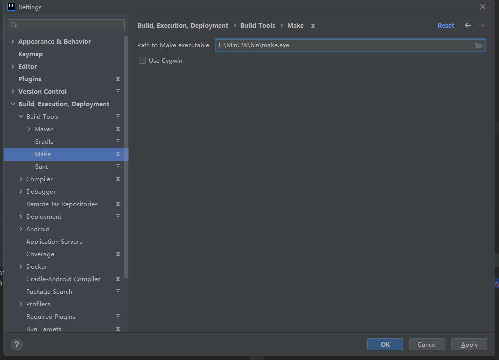

## 安装地址

+ [官方地址](https://golang.org/dl)  👉  https://golang.org/dl
+ [中国镜像地址](https://golang.google.cn/dl/)  👉  https://golang.google.cn/dl/

```shell
go version
```

+ 设置全局环境变量: go下载代理，防止相关文件下载超时
```yaml
GOPROXY: https://goproxy.io,direct
```

+ 设置全局环境变量: go依赖下载路径
```yaml
GOPATH: E:\data\go
```

## 安装 make 工具

+ MinGW（Minimalist GNU for Windows）是一个为 Windows 系统提供的自由软件开发环境，它包含了一组适用于 Windows 的 GNU 工具集，包括编译器、链接器、调试器和其他相关工具。MinGW 使得开发者能够在 Windows 平台上编写和编译源代码，而不需要第三方 C 运行时库。
+ 主要包含: GCC, Binutils, Make, GDB 等常用组件
+ [下载地址](https://sourceforge.net/projects/mingw/files/latest/download?source=files)  👉  https://sourceforge.net/projects/mingw/files/latest/download?source=files
+ 全局变量中设置安装目录`E:\MinGW\bin`
+ 在安装目录下 `E:\MinGW\bin` 复制文件 `copy mingw32-make.exe make.exe`
+ 检查安装结果 `make -v`; IDEA设置make路径



## 安装依赖包

``` bash
$ go mod tidy
```
