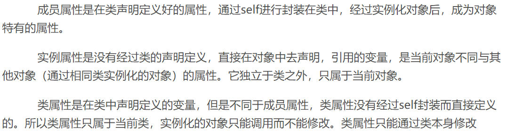
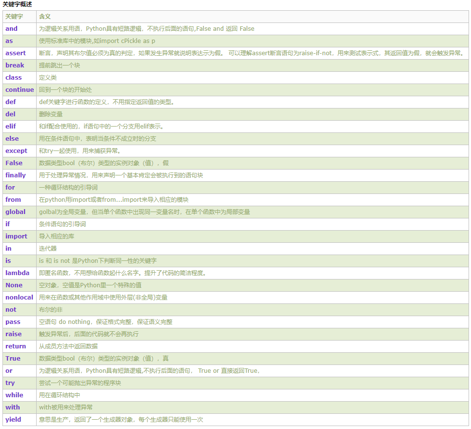

## Python安装

+ [官网地址](https://www.python.org/)

## Python基础知识


标识符 英文/数字/下划线

单下划线开头

_foo 不能直接访问的类属性(private)需提供接口 不能用 from xxx import * 导入

双下划线开头

__foo 私有成员

双下划线开头结尾

__foo__ 特殊方法专用标识 __init__() 构造函数

成员属性(字段)/实例属性(map)/类属性(静态公有变量)



关键字



数据类型(5)

Number(数字) String(字符串) List(列表) Tuple(元组) Dictionatry(字典)

## Python函数

```python
def func_name(param_name):
    print(param_name)
```

## 安装包

```bash
cd {安装路径}/Scripts
pip install {package}
pip install --upgrade {package}
```
### conda

conda是一种可用于python的包管理工具
如果系统没有安装python环境，也可以使用 conda 内置的python安装包

+ [官方文档](https://docs.conda.io/en/latest/miniconda.html#windows-installers)
+ [conda 简单介绍](https://baijiahao.baidu.com/s?id=1677257712310498702&wfr=spider&for=pc)

安装成功后使用对应的控制面板 >>> `Anaconda Prompt`
```shell
conda --version
python --version
pip --version
```

#### 设置默认下载的镜像地址

注意: 可以先安装包、如果包下载异常才考虑用镜像 或者 考虑用 pip 下载工具

[使用conda添加镜像源](https://www.python100.com/html/T3QF9436G2NX.html)

```shell
# https://mirrors.tuna.tsinghua.edu.cn/help/pypi/
conda config --add channels https://mirrors.tuna.tsinghua.edu.cn/anaconda/pkgs/free/ # 增加清华大学镜像源
conda config --remove channels <镜像源>  # 删除指定镜像源镜像
conda config --remove-key channels # 删除全部镜像源
conda config --write # 保存配置
conda config --default-channel # windows环境无法使用该命令设置默认镜像源
conda config --set-default-channel https://mirrors.tuna.tsinghua.edu.cn/anaconda/pkgs/free # 将某镜像设置为默认通道
conda config --show channels # 展示所有镜像源
```

添加常用的镜像源

```shell
conda config --add channels https://pypi.tuna.tsinghua.edu.cn/simple/ # python 软件包索引源
conda config --add channels https://mirrors.tuna.tsinghua.edu.cn/anaconda/pkgs/main/
conda config --add channels https://mirrors.tuna.tsinghua.edu.cn/anaconda/pkgs/free/
conda config --add channels https://mirrors.tuna.tsinghua.edu.cn/anaconda/cloud/conda-forge/
conda config --add channels https://mirrors.tuna.tsinghua.edu.cn/anaconda/cloud/pytorch/
```

#### conda创建环境

+ conda是为了解决不同python项目依赖差异的问题, 可以创建多个环境处理这个问题

```shell
conda env list # 查看所有已经传教的环境
conda create --name <envname> # 创建一个新的conda环境
conda create -n chatglm --clone base # 创建一个克隆环境
conda create --prefix=E:/data/miniconda3/envs/chatGLM # 显式的指定路径，激活也需要指定路径，比较麻烦，可以直接更改环境地址
conda config --append envs_dirs E:/data/miniconda3/envs # 配置环境所在的默认路径
conda create --name snapshot --clone myenv # 从已有的环境克隆配置新环境
conda activate <envname> # 激活新的环境
conda deactivate # 退出环境
conda env remove --name <envname> # 删除环境
conda install --file requirements.txt # 安装项目要求的环境依赖项
conda list # 验证所有依赖项是否已经安装正确
```

#### conda简单命令

```shell
conda install <package> # 安装包
conda install <package>=<version> # 安装指定版本包
conda update <package> # 更新包
conda remove <package> # 卸载包
conda search <package> # 搜索包
conda list [-n [env_name]] # 展示当前环境安装的所有包 -n 指定环境名称
conda list <package> # 查看指定包版本信息
conda info --envs # 查看环境中的安装包版本
conda clean --all # 清理不再使用的包
conda env export > environment.yml # 导出环境配置
conda env create --file environment.yml # 导入环境配置
```

## 字符串转json

```python
import json
# len(str) > 0
json.loads(str)
```

## 发送HTTP请求

### 引入 requests 包
```python
import requests
```

+ 发送请求(包括请求行、方法类型、头、体) & 常见的请求方式有get、post、put、delete

### 发送get请求

格式：requests.get() (内容： url必填； params选填：url参数字典)

#### 无参数的get请求
```python
res = requests.get(url='https://yz.chsi.com.cn/zsml/pages/getMl.jsp')
# 打印响应主体内容，字符串格式
print(res.text)
```
#### 有参数的get请求
```python
res = requests.get(url='https://yz.chsi.com.cn/zsml/code/zy.do',
                   params={"q": '0101'})
# 打印响应主体内容，字符串格式
print(res.text)
```

### 发送post请求
> 知识扩展

+ requests.post() post请求分为5种，常用的有三种，如下
  + ① application/x-www-form-urlencod (form表单)；
  + ② raw (纯文本格式)：有5种格式，分别为json/xml/Html/Text/JavaScrip
  + ③ multipart/form-data (复合式表单)

#### 有正文体的post请求

##### form表单(application/x-www-form-urlencod) ----data 后跟字典

> eg.1: 带参数的查询接口

```python
res = requests.post(url='http://ws.webxml.com.cn/WebServices/WeatherWS.asmx/getSupportCityString',
headers={"Content-Type": "application/x-www-form-urlencoded"},
data={"theRegionCode": 3113})
print(res.text)
```
> eg.2: 带账号名密码的登录接口

```python
res = requests.post(url='http://123.56.99.53:9000/event/api/admin/',
headers={"Content-Type": "application/x-www-form-urlencoded"},
data={"username": "admin", "password": "MTIzYWRtaW4="})
print(res.text)
```
##### 纯文本格式(raw)

> ~ xml格式    ----data    后跟字符串

```python
res = requests.post(url='http://ws.webxml.com.cn/WebServices/WeatherWS.asmx',
headers ={"Content-Type": "text/xml; charset=utf-8",
"SOAPAction": "http://WebXml.com.cn/getSupportCityString"},
data = '''<?xml version="1.0" encoding="utf-8"?>
<soap:Envelope xmlns:xsi="http://www.w3.org/2001/XMLSchema-instance" xmlns:xsd="http://www.w3.org/2001/XMLSchema" xmlns:soap="http://schemas.xmlsoap.org/soap/envelope/">
<soap:Body>
<getSupportCityString xmlns="http://WebXml.com.cn/">
<theRegionCode>string</theRegionCode>
</getSupportCityString>
</soap:Body>
</soap:Envelope>''')
print(res.text)
```

> ~json格式     ----- json  后跟字典(常用)， or ----data  后跟json字符串

```python
res = requests.post(url='http://123.56.99.53:5000/event/weather/getWeather/',
headers={"Content-Type": "application/json"},
json={"theCityCode": "1001"})
print(res.text)
```

json后面跟的是字典即json={"theCityCode": "1001"})，可改成 data=‘{"theCityCode": "1001"})’；字典能自动转为json字符串，所以一般用字典表示；建议纯json正文的接口使用第一种方式，除非是较长的字符串

> 复合式表单(multipart/form-data ) ------上传二进制文件    ---- key value (接口名称：文件名）

```python
res = requests.post(url='http://123.56.99.53:9001/api/uploadFile/',
headers={"Cookie": "uid=1;token=44c972f05d76fdd93c31f9c2b65bb098f308cdfc"
#"Content-Type": "multipart/form-data"},
#有的接口不需要写正文体格式，老服务器一般需要写
              files={"myfile1": open('D:\全力以富\1.docx', 'rb')
                     #"myfile2: open(上传多个文件)"})
print(res.text)
```
上传接口 files={‘文件路径’,‘rb'}  rb表示

## 问题解决

### pycharm提示ModuleNotFoundError: No module named `requests`

File > Settings > Project: {project-name} > Python Interpreter
