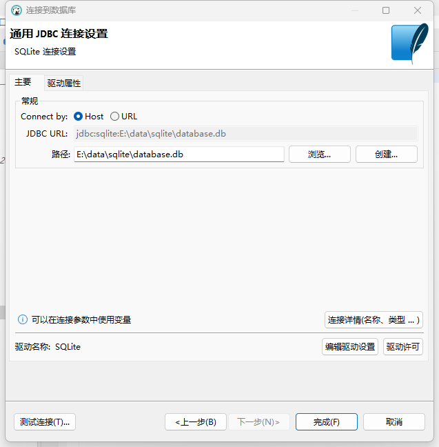

无需下载任何安装包，也无需启动任何数据库服务。就能维护一个SQLite数据库及在Spring程序中使用SQLite数据库。

## DBeaver连接SQLite(DBeaver会自动安装相关驱动)

+ 任意文件夹下创建一个文件，文件名为 `database.db`
+ 新建一个SQLite连接，填写文件路径

+ 菜鸟教程 https://www.runoob.com/sqlite/sqlite-data-types.html

