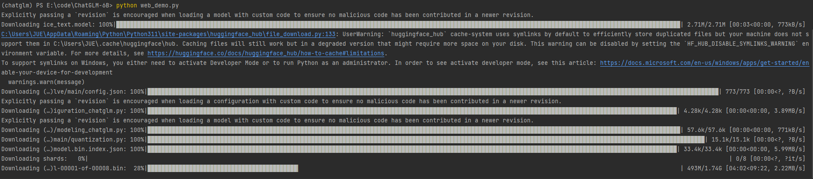

## 前言

+ 本系列文章旨在使用 ChatGLM 预处理模型接入业务系统，完成项目助手类插件服务开发调用
+ 基本思路是学会使用基础模型、学会微调基础模型、了解并掌握向量数据库的使用(实时数据交互)、完成业务接入 <u>NLP</u> 服务
+ 本文是系列文章第一篇：启动 ChatGLM 模型

## 提前安装

### conda

+ [conda](https://docs.conda.io/en/latest/miniconda.html#windows-installers) 是python包管理工具、可以安装一个内置的 [python](https://www.python.org/)

+ [配置阿里数据源](https://developer.aliyun.com/mirror/anaconda)

```shell
conda config --set show_channel_urls yes # windows 生成 .condarc 文件配置
conda clean -i # 配置完成后，清理索引缓存;JSONDecodeError 异常可以尝试执行该命令
conda config --show channels # 展示所有镜像源
```

+ 用户目录下 .condarc 文件配置
```text
channels:
  - defaults
show_channel_urls: true
default_channels:
  - http://mirrors.aliyun.com/anaconda/pkgs/main
  - http://mirrors.aliyun.com/anaconda/pkgs/r
  - http://mirrors.aliyun.com/anaconda/pkgs/msys2
custom_channels:
  conda-forge: http://mirrors.aliyun.com/anaconda/cloud
  msys2: http://mirrors.aliyun.com/anaconda/cloud
  bioconda: http://mirrors.aliyun.com/anaconda/cloud
  menpo: http://mirrors.aliyun.com/anaconda/cloud
  pytorch: http://mirrors.aliyun.com/anaconda/cloud
  simpleitk: http://mirrors.aliyun.com/anaconda/cloud
```

+ 检查是否安装成功

```shell
conda --version
```

+ 创建一个新的项目环境；后续所有安装都在该环境下进行

```shel
conda create -n chatglm python=3.10 # 创建一个新的环境，需要指定python版本
conda env list # 展示所有环境 conda env remove --name chatglm
conda activate chatglm # 激活新创建的环境; conda deactivate # 退出当前环境
```

### pytorch

+ [pytorch](https://pytorch.org) # 根据 CUDA 版本选择正确的安装命令; `nvidia-smi` 查看对应 version

```shell
nvidia-smi # 查询显存大小，至少需要4.3G显存(window默认使用 GPU专用内存)
# 当前系统查询出来 CUDA版本为 11.6；前往历史版本下载对应的环境版本
conda install pytorch==1.13.1 torchvision==0.14.1 torchaudio==0.13.1 pytorch-cuda=11.6 -c pytorch -c nvidia
# 当前系统查询出来 CUDA版本为 12.3；前往历史版本下载对应的环境版本 https://pytorch.org/get-started/previous-versions/
pip install torch==2.7.1 torchvision==0.22.1 torchaudio==2.7.1 --index-url https://download.pytorch.org/whl/cu126
# 当conda下载速度过慢，使用pip直接下载
pip install torch==1.13.1+cu116 torchvision==0.14.1+cu116 torchaudio==0.13.1 --extra-index-url https://download.pytorch.org/whl/cu116
# Err:  HTTPSConnectionPool(host='files.pythonhosted.org', port=443): Read timed out
pip3 config --global set global.index-url https://mirrors.aliyun.com/pypi/simple/
```

### MinGW

+ 安装 [MinGW](https://www.mingw-w64.org/downloads/#w64devkit)

+ 推荐使用 [TDM-GCC](https://jmeubank.github.io/tdm-gcc/) 安装

+ 检查是否安装成功

```shell
gcc -v
```

## 下载并启动 chatGLM 代码

### 下载仓库代码

```shell
git clone git@github.com:THUDM/ChatGLM-6B.git # https://github.com/THUDM/ChatGLM-6B.git
```

### 下载预处理模型

```shell
# git submodule add git@hf.co:THUDM/chatglm-6b-int4 ./THUDM/chatglm-6b-int4
# 在项目根目录下创建`THUDM`模型文件夹，同时进入目录克隆模型[注册一个账户配置 ssh 可以下载更快]
git clone git@hf.co:THUDM/chatglm-6b-int4 # https://huggingface.co/THUDM/chatglm-6b-int4

# git大文件存储工具
git lfs install
cd chatglm-6b-int4
# 大文件下载；如果不能下载，前往下方地址手动下载模型置于当前文件夹
git lfs pull
# 如果出现 `Error updating the git index Unable to process path pytorch_model.binUnable to process path pytorch_model.bin`; 尝试执行下面语句
git reset --hard # 执行之后重新拉取代码即可
```

[清华大学模型下载地址](https://cloud.tsinghua.edu.cn/d/674208019e314311ab5c/)

| 模型名称        | 模型大小 | 模型所需GPT与内存    |
| --------------- | -------- | -------------------- |
| chatglm-6b      | 12.4g    | 最低13G显存，16G内存 |
| chatglm-6b-int8 | 7.2G     | 最低8G显存       |
| chatglm-6b-int4 | 3.6G     | 最低4.3G显存         |

### 运行web示例demo

```shell
conda install --file requirements.txt # 提示找不到包时可增加其他镜像源

# 添加清华镜像源
conda config --add channels https://mirrors.tuna.tsinghua.edu.cn/anaconda/pkgs/main/
conda config --add channels https://mirrors.tuna.tsinghua.edu.cn/anaconda/pkgs/free/
conda config --add channels https://mirrors.tuna.tsinghua.edu.cn/anaconda/cloud/conda-forge/
conda config --add channels https://mirrors.tuna.tsinghua.edu.cn/anaconda/cloud/pytorch/
conda config --show channels

# pip install -r requirements.txt -i https://mirror.sjtu.edu.cn/pypi/web/simple
pip install mdtex2html torch cpm_kernels # 提示找不到包尝试用pip命令安装
# 下载模型文件, 创建`THUDM`文件夹
# 需要更改文件上方模型路径; 原为 `THUDM/chatglm-6b` > `THUDM\chatglm-6b-int4`; win环境下文件分隔符不同
python web_demo.py
```

+ 项目加载模型数据



## 无GPU部署`JittorLLMs`

### 更新`jittor`环境

```shell
git clone git@github.com:Jittor/JittorLLMs.git
cd JittorLLMs
conda create -n jittor-chatglm python=3.10 # 新建一个环境尝试简单显存要求
conda activate jittor-chatglm
# -i 指定用jittor的源， -I 强制重装Jittor版torch
pip install -r requirements.txt -i https://pypi.jittor.org/simple -I
```

+ requirements.txt 依赖声明如下

```text
# requirements.txt
jittor == 1.3.8.5
jtorch == 0.1.7
torch
torchvision
```


## ~~部署`Langchain-Chatchat`~~ 

> `Langchain-Chatchat` 一个基于 `chatGLM` 的本地知识库实现

### 下载代码

```shell
git clone git@github.com:chatchat-space/Langchain-Chatchat.git # https://github.com/chatchat-space/Langchain-Chatchat
```

### 下载模型

可参考上一节使用`git lfs pull`进行大文件下载

以本项目中默认使用的 LLM 模型 [THUDM/chatglm2-6b](https://huggingface.co/THUDM/chatglm2-6b) 与 Embedding 模型 [moka-ai/m3e-base](https://huggingface.co/moka-ai/m3e-base) 为例 

```shell
git clone git@hf.co:THUDM/chatglm-6b-int4 # https://huggingface.co/THUDM/chatglm-6b-int4
git clone git@hf.co:moka-ai/m3e-base # https://huggingface.co/moka-ai/m3e-base
```

### 更改配置文件

复制项目文件 `./configs/model_config.py.example` > ``./configs/model_config.py`

复制项目文件 `./configs/server_config.py.example` > ``./configs/model_config.py`


### 初始化知识库

```shell
conda create -n chatchat python=3.10 # 新的conda环境
conda activate chatchat
conda install --file requirements.txt
```

## 其他代码仓库地址

```shell
git clone git@github.com:THUDM/ChatGLM2-6B.git # https://github.com/THUDM/ChatGLM2-6B # chatGLM 升级内容

git clone git@github.com:THUDM/CodeGeeX2.git # https://github.com/THUDM/CodeGeeX2 # chatGLM 代码能力加强模型

git clone git@hf.co:TMElyralab/lyraChatGLM.git # https://huggingface.co/TMElyralab/lyraChatGLM # 对 ChatGLM-6B 进行推理加速，最高可以实现 9000+ tokens/s 的推理速度

git clone git@github.com:wangzhaode/ChatGLM-MNN.git # https://github.com/wangzhaode/ChatGLM-MNN # 一个基于 MNN 的 ChatGLM-6B C++ 推理实现，支持根据显存大小自动分配计算任务给 GPU 和 CPU

git clone git@github.com:Jittor/JittorLLMs.git # https://github.com/Jittor/JittorLLMs # 最低3G显存或者没有显卡都可运行 ChatGLM-6B FP16， 支持Linux、windows、Mac部署

git clone git@github.com:MegEngine/InferLLM.git # https://github.com/MegEngine/InferLLM # 轻量级 C++ 推理，可以实现本地 x86，Arm 处理器上实时聊天，手机上也同样可以实时运行，运行内存只需要 4G
```

## 名词解释

### NLP

NLP 是自然语言处理（Natural Language Processing）的缩写，本文学习的 transformers 是一种自然语言处理的思想及技术

### Hugging face

Hugging face 起初是一家聊天机器人初创服务商，其在github上开源了 Transformers python 库。
还提供了 Trainer （构建和训练自定义模型的框架） 、 Tuning （用于微调预训练模型的库）等库。
这些工具和库都使用 Python 编写，并支持多种不同的深度学习框架，如 PyTorch 和 TensorFlow 等。
主要目的是为 NLP 社区提供一个统一的框架，便于研究人员和开发人员能够轻松地使用最先进的预训练模型，并将其应用于各种不同的 NLP 任务中。

### PyTorch

PyTorch 是一个开源的Python机器学习库，Hugging face很多模型需要前置安装 PyTorch

### Transformer

Transformer 是 <u>Hugging face</u> 提供的自然语言处理工具库，也是当前比较流行的机器学习工具库。
因为NLP通常是多个任务顺序而成，通常使用 `transformer` 中 `pipeline` 进行流水线工作

```shell
# pip 是 python 包管理工具, Python 3.4+ 自带pip工具
pip install transformers==4.26.1 # 安装指定版本
pip install tensorflow
# 如果你是conda的话
conda install -c huggingface transformers  # 4.0以后的版本才会有
```

### requirements.txt

Python项目中必须包含一个 requirements.txt 文件，用于记录所有依赖包及其精确的版本号。以便新环境部署。
```shell
pip freeze > requirements.txt # 生成requirements.txt
pip install -r requirements.txt # 从requirements.txt安装依赖
```

## 参考资料

+ [Hugging face 官方网站](https://huggingface.co/models)
+ [Huggingface 超详细介绍](https://zhuanlan.zhihu.com/p/535100411)
+ [从零开始的ChatGLM 配置详细教程](https://blog.csdn.net/qq_51116518/article/details/130299417)
