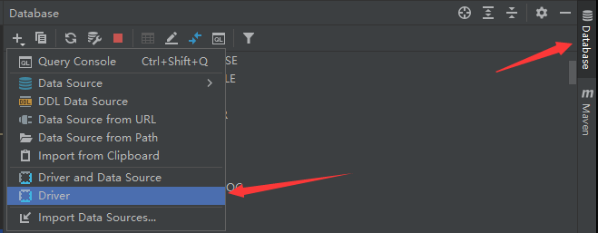
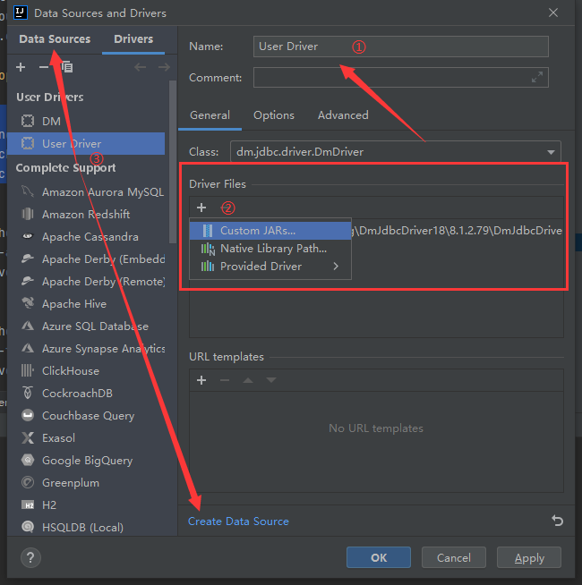
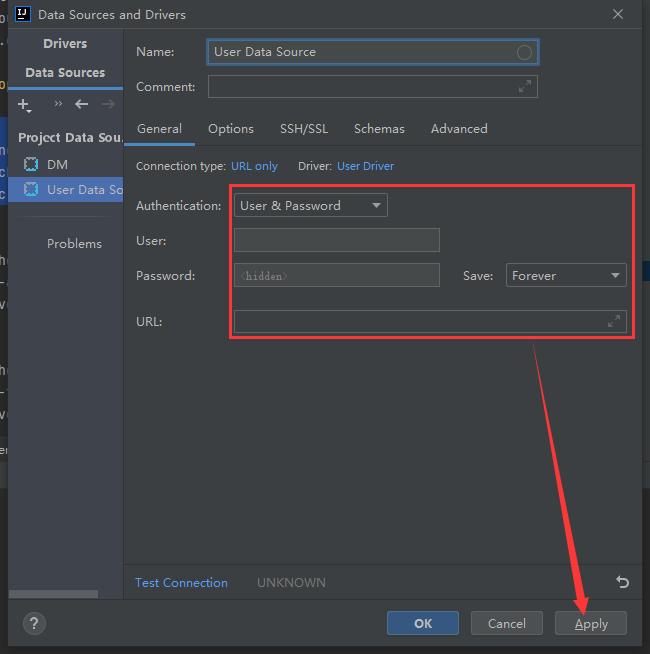

## a. 准备达梦驱动

+ 可从maven本地仓库中获取

```xml
<dependency>
    <groupId>com.dameng</groupId>
    <artifactId>DmJdbcDriver18</artifactId>
    <version>${dm-jdbc-driver.version}</version>
</dependency>
```

## b. 新建一个驱动



## c. 导入驱动需要的jar包



## d. 新建数据库连接



