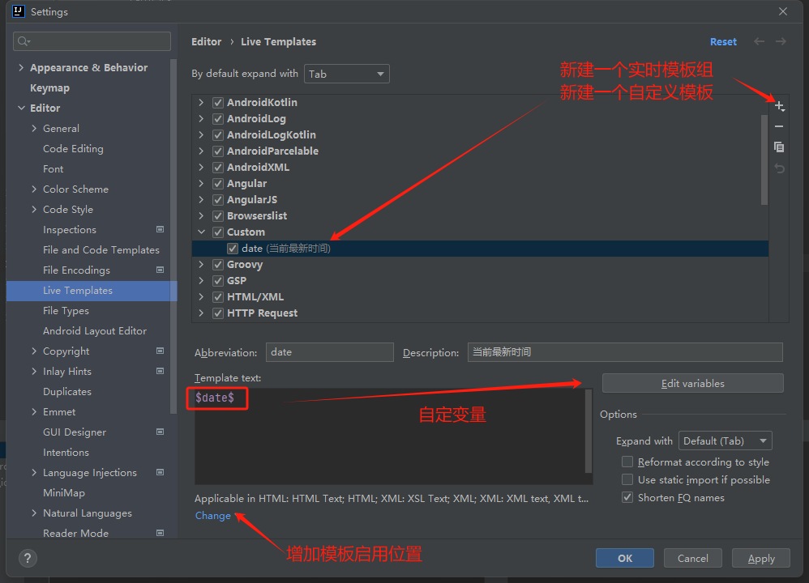
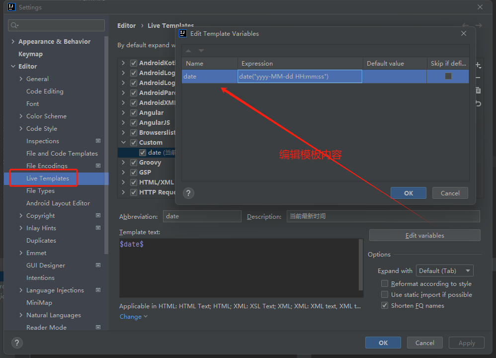
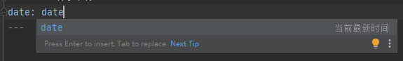

## IDEA无限试用

最新IDEA只有短期的有效试用时间, 且验证了用户邮箱; 可使用lzu后缀的学校邮箱 或 删除注册表重复试用试用

[IDEA历史版本](https://www.jetbrains.com/idea/download/other.html)

直接下载地址 [2021.2.1](https://download.jetbrains.com/idea/ideaIU-2021.2.1.exe?_gl=1*161tx0f*_ga*ODYyMzc1MDUuMTU4NDE4MDU0MQ..*_ga_9J976DJZ68*MTY2NTgwOTY1NS4zLjAuMTY2NTgwOTY1Ni4wLjAuMA..&_ga=2.180236583.2030136809.1665809656-86237505.1584180541)

### 手动试用版

删除文件及注册表

```text
C:\Users\JUE\AppData\Roaming\JetBrains\IntelliJIdea2021.2\eval\*
C:\Users\JUE\AppData\Roaming\JetBrains\IntelliJIdea2021.2\options\other.xml
HKEY_CURRENT_USER\Software\JavaSoft\Prefs\jetbrains\*
```

### 插件试用

1. 导入第三方插件地址 `https://plugins.zhile.io`
2. 搜索 ide eval reset 安装
3. help --eval reset (可以打开启动自动更新无限试用时间)

### 其他方法: 2024.1.4

https://www.quanxiaoha.com/idea-pojie/idea-pojie-20241.html
https://www.cnblogs.com/gdutxiaoxu/p/17098362.html

+ 激活码
```
6G5NXCPJZB-eyJsaWNlbnNlSWQiOiI2RzVOWENQSlpCIiwibGljZW5zZWVOYW1lIjoic2lnbnVwIHNjb290ZXIiLCJhc3NpZ25lZU5hbWUiOiIiLCJhc3NpZ25lZUVtYWlsIjoiIiwibGljZW5zZVJlc3RyaWN0aW9uIjoiIiwiY2hlY2tDb25jdXJyZW50VXNlIjpmYWxzZSwicHJvZHVjdHMiOlt7ImNvZGUiOiJQU0kiLCJmYWxsYmFja0RhdGUiOiIyMDI1LTA4LTAxIiwicGFpZFVwVG8iOiIyMDI1LTA4LTAxIiwiZXh0ZW5kZWQiOnRydWV9LHsiY29kZSI6IlBEQiIsImZhbGxiYWNrRGF0ZSI6IjIwMjUtMDgtMDEiLCJwYWlkVXBUbyI6IjIwMjUtMDgtMDEiLCJleHRlbmRlZCI6dHJ1ZX0seyJjb2RlIjoiSUkiLCJmYWxsYmFja0RhdGUiOiIyMDI1LTA4LTAxIiwicGFpZFVwVG8iOiIyMDI1LTA4LTAxIiwiZXh0ZW5kZWQiOmZhbHNlfSx7ImNvZGUiOiJQUEMiLCJmYWxsYmFja0RhdGUiOiIyMDI1LTA4LTAxIiwicGFpZFVwVG8iOiIyMDI1LTA4LTAxIiwiZXh0ZW5kZWQiOnRydWV9LHsiY29kZSI6IlBHTyIsImZhbGxiYWNrRGF0ZSI6IjIwMjUtMDgtMDEiLCJwYWlkVXBUbyI6IjIwMjUtMDgtMDEiLCJleHRlbmRlZCI6dHJ1ZX0seyJjb2RlIjoiUFNXIiwiZmFsbGJhY2tEYXRlIjoiMjAyNS0wOC0wMSIsInBhaWRVcFRvIjoiMjAyNS0wOC0wMSIsImV4dGVuZGVkIjp0cnVlfSx7ImNvZGUiOiJQV1MiLCJmYWxsYmFja0RhdGUiOiIyMDI1LTA4LTAxIiwicGFpZFVwVG8iOiIyMDI1LTA4LTAxIiwiZXh0ZW5kZWQiOnRydWV9LHsiY29kZSI6IlBQUyIsImZhbGxiYWNrRGF0ZSI6IjIwMjUtMDgtMDEiLCJwYWlkVXBUbyI6IjIwMjUtMDgtMDEiLCJleHRlbmRlZCI6dHJ1ZX0seyJjb2RlIjoiUFJCIiwiZmFsbGJhY2tEYXRlIjoiMjAyNS0wOC0wMSIsInBhaWRVcFRvIjoiMjAyNS0wOC0wMSIsImV4dGVuZGVkIjp0cnVlfSx7ImNvZGUiOiJQQ1dNUCIsImZhbGxiYWNrRGF0ZSI6IjIwMjUtMDgtMDEiLCJwYWlkVXBUbyI6IjIwMjUtMDgtMDEiLCJleHRlbmRlZCI6dHJ1ZX1dLCJtZXRhZGF0YSI6IjAxMjAyMjA5MDJQU0FOMDAwMDA1IiwiaGFzaCI6IlRSSUFMOi0xMDc4MzkwNTY4IiwiZ3JhY2VQZXJpb2REYXlzIjo3LCJhdXRvUHJvbG9uZ2F0ZWQiOmZhbHNlLCJpc0F1dG9Qcm9sb25nYXRlZCI6ZmFsc2V9-SnRVlQQR1/9nxZ2AXsQ0seYwU5OjaiUMXrnQIIdNRvykzqQ0Q+vjXlmO7iAUwhwlsyfoMrLuvmLYwoD7fV8Mpz9Gs2gsTR8DfSHuAdvZlFENlIuFoIqyO8BneM9paD0yLxiqxy/WWuOqW6c1v9ubbfdT6z9UnzSUjPKlsjXfq9J2gcDALrv9E0RPTOZqKfnsg7PF0wNQ0/d00dy1k3zI+zJyTRpDxkCaGgijlY/LZ/wqd/kRfcbQuRzdJ/JXa3nj26rACqykKXaBH5thuvkTyySOpZwZMJVJyW7B7ro/hkFCljZug3K+bTw5VwySzJtDcQ9tDYuu0zSAeXrcv2qrOg==-MIIETDCCAjSgAwIBAgIBDTANBgkqhkiG9w0BAQsFADAYMRYwFAYDVQQDDA1KZXRQcm9maWxlIENBMB4XDTIwMTAxOTA5MDU1M1oXDTIyMTAyMTA5MDU1M1owHzEdMBsGA1UEAwwUcHJvZDJ5LWZyb20tMjAyMDEwMTkwggEiMA0GCSqGSIb3DQEBAQUAA4IBDwAwggEKAoIBAQCUlaUFc1wf+CfY9wzFWEL2euKQ5nswqb57V8QZG7d7RoR6rwYUIXseTOAFq210oMEe++LCjzKDuqwDfsyhgDNTgZBPAaC4vUU2oy+XR+Fq8nBixWIsH668HeOnRK6RRhsr0rJzRB95aZ3EAPzBuQ2qPaNGm17pAX0Rd6MPRgjp75IWwI9eA6aMEdPQEVN7uyOtM5zSsjoj79Lbu1fjShOnQZuJcsV8tqnayeFkNzv2LTOlofU/Tbx502Ro073gGjoeRzNvrynAP03pL486P3KCAyiNPhDs2z8/COMrxRlZW5mfzo0xsK0dQGNH3UoG/9RVwHG4eS8LFpMTR9oetHZBAgMBAAGjgZkwgZYwCQYDVR0TBAIwADAdBgNVHQ4EFgQUJNoRIpb1hUHAk0foMSNM9MCEAv8wSAYDVR0jBEEwP4AUo562SGdCEjZBvW3gubSgUouX8bOhHKQaMBgxFjAUBgNVBAMMDUpldFByb2ZpbGUgQ0GCCQDSbLGDsoN54TATBgNVHSUEDDAKBggrBgEFBQcDATALBgNVHQ8EBAMCBaAwDQYJKoZIhvcNAQELBQADggIBABqRoNGxAQct9dQUFK8xqhiZaYPd30TlmCmSAaGJ0eBpvkVeqA2jGYhAQRqFiAlFC63JKvWvRZO1iRuWCEfUMkdqQ9VQPXziE/BlsOIgrL6RlJfuFcEZ8TK3syIfIGQZNCxYhLLUuet2HE6LJYPQ5c0jH4kDooRpcVZ4rBxNwddpctUO2te9UU5/FjhioZQsPvd92qOTsV+8Cyl2fvNhNKD1Uu9ff5AkVIQn4JU23ozdB/R5oUlebwaTE6WZNBs+TA/qPj+5/we9NH71WRB0hqUoLI2AKKyiPw++FtN4Su1vsdDlrAzDj9ILjpjJKA1ImuVcG329/WTYIKysZ1CWK3zATg9BeCUPAV1pQy8ToXOq+RSYen6winZ2OO93eyHv2Iw5kbn1dqfBw1BuTE29V2FJKicJSu8iEOpfoafwJISXmz1wnnWL3V/0NxTulfWsXugOoLfv0ZIBP1xH9kmf22jjQ2JiHhQZP7ZDsreRrOeIQ/c4yR8IQvMLfC0WKQqrHu5ZzXTH4NO3CwGWSlTY74kE91zXB5mwWAx1jig+UXYc2w4RkVhy0//lOmVya/PEepuuTTI4+UJwC7qbVlh5zfhj8oTNUXgN0AOc+Q0/WFPl1aw5VV/VrO8FCoB15lFVlpKaQ1Yh+DVU8ke+rt9Th0BCHXe0uZOEmH0nOnH/0onD
```

## 常用配置

### Git在信息栏中显示本地修改

File > Settings > Version Control > Commit -> Use non-modal commit interface

取消勾选上述选项

### 版本管理本地修改在文件夹路径中体现

File > Settings > Version Control -> Show directories with changed descendants

勾选上述选项

### 根据文件类型调整生成的模板(eg. 新建java文件时带上作者名)

File > Settings > Editor > File and Code Templates

#### Markdown

File:

- Name: Markdown
- Extension: md

```
---
title: ${NAME}
date: ${YEAR}-${MONTH}-${DAY} ${HOUR}:${MINUTE}:${SECOND}
keywords: ${NAME}
summary: ${NAME}
tags:
    - ${NAME}
---
```

### 调整java生成 getter setter 代码模板

File > Setting > Editor > Code Style > Java > Code Generation

#### customGetter

```text thymeleaftemplatesfragmentexpressions
#if($field.modifierStatic)
static ##
#end
$field.type ##
$field.name ##
() {
return $field.name;
}
```

#### customSetter

```text thymeleaftemplatesfragmentexpressions
#set($paramName = $helper.getParamName($field, $project))
public ##
#if($field.modifierStatic)
static void ##
#else
    $classSignature ##
#end
$field.name ($field.type $paramName) {
#if ($field.name == $paramName)
    #if (!$field.modifierStatic)
    this.##
    #else
        $classname.##
    #end
#end
$field.name = $paramName;
#if(!$field.modifierStatic)
return self();
#end
}
```

### 快捷键快速生成当前日期

File > Settings > Editor > Live Template





使用方法：内容里面直接输入`date`即可



## 推荐插件

> Setting Plugins

### leetcode-editor

利用编译器查看提交leetcode题目

### CodeGeeX

编码提示插件

+ `TAB`使用推荐语法
+ `Alt + [` 切换推荐

#### 配置文件

```
D:\code\basic-java\src\main\java\com\jue\java\learn
```

```
$!velocityTool.camelCaseName(${question.titleSlug})/$!velocityTool.camelCaseName(${question.titleSlug})
```

```
${question.content}

package com.jue.java.learn.leetcode.editor.cn.$!velocityTool.camelCaseName(${question.titleSlug});

/**
 * @author JUE
 * @number ${question.frontendQuestionId}
 */
public class $!velocityTool.camelCaseName(${question.titleSlug}) {
    public static void main(String[] args) {
        Solution solution = new Solution();
    }
}

${question.code}
```

## 异常解决

### 项目maven构建成功但是启动失败的解决(统一构建环境与启动环境)


### TypeError: this.cliEngineCtor is not a constructor

+ 点击detail, 打开安装路径下`eslint-plugin.js`文件
+ 修改文件(需要管理员权限) `this.cliEngineCtor`
```js
// this.cliEngineCtor = requireInContext(eslintPackagePath + "lib/api", state.packageJsonPath).CLIEngine;
this.cliEngineCtor = requireInContext(eslintPackagePath + "lib/cli-engine", state.packageJsonPath).CLIEngine;
```
+ 重启项目
