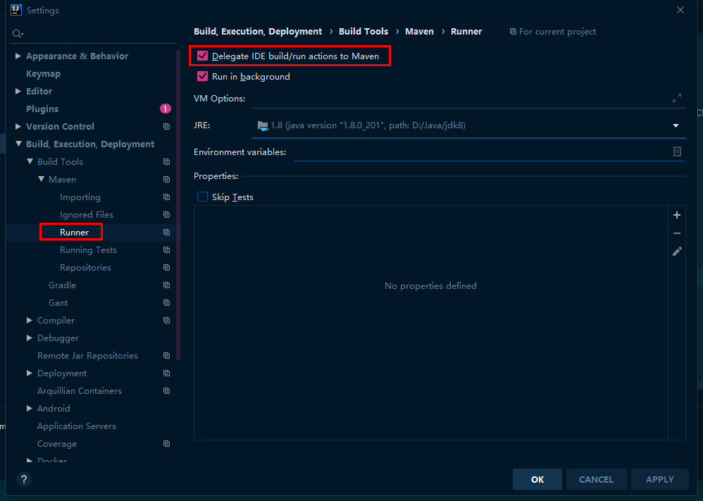

## IDEA无限试用

最新IDEA只有短期的有效试用时间, 且验证了用户邮箱; 可使用lzu后缀的学校邮箱 或 删除注册表重复试用试用

[IDEA历史版本](https://www.jetbrains.com/idea/download/other.html)

直接下载地址 [2021.2.1](https://download.jetbrains.com/idea/ideaIU-2021.2.1.exe?_gl=1*161tx0f*_ga*ODYyMzc1MDUuMTU4NDE4MDU0MQ..*_ga_9J976DJZ68*MTY2NTgwOTY1NS4zLjAuMTY2NTgwOTY1Ni4wLjAuMA..&_ga=2.180236583.2030136809.1665809656-86237505.1584180541)

### 手动试用版

删除文件及注册表

```text
C:\Users\JUE\AppData\Roaming\JetBrains\IntelliJIdea2021.2\eval\*
C:\Users\JUE\AppData\Roaming\JetBrains\IntelliJIdea2021.2\options\other.xml
HKEY_CURRENT_USER\Software\JavaSoft\Prefs\jetbrains\*
```

### 插件试用

1. 导入第三方插件地址 `https://plugins.zhile.io`
2. 搜索 ide eval reset 安装
3. help --eval reset (可以打开启动自动更新无限试用时间)

## 常用配置

### Git在信息栏中显示本地修改

File > Settings > Version Control > Commit -> Use non-modal commit interface

取消勾选上述选项

### 版本管理本地修改在文件夹路径中体现

File > Settings > Version Control -> Show directories with changed descendants

勾选上述选项

### 根据文件类型调整生成的模板(eg. 新建java文件时带上作者名)

File > Settings > Editor > File and Code Templates

#### Markdown

File:

- Name: Markdown
- Extension: md

```
---
title: ${NAME}
date: ${YEAR}-${MONTH}-${DAY} ${HOUR}:${MINUTE}:${SECOND}
keywords: ${NAME}
summary: ${NAME}
tags:
    - ${NAME}
---
```

### 调整java生成 getter setter 代码模板

File > Setting > Editor > Code Style > Java > Code Generation

#### customGetter

```thymeleaftemplatesfragmentexpressions
#if($field.modifierStatic)
static ##
#end
$field.type ##
$field.name ##
() {
return $field.name;
}
```

#### customSetter

```thymeleaftemplatesfragmentexpressions
#set($paramName = $helper.getParamName($field, $project))
public ##
#if($field.modifierStatic)
static void ##
#else
    $classSignature ##
#end
$field.name ($field.type $paramName) {
#if ($field.name == $paramName)
    #if (!$field.modifierStatic)
    this.##
    #else
        $classname.##
    #end
#end
$field.name = $paramName;
#if(!$field.modifierStatic)
return self();
#end
}
```

## 推荐插件

> Setting Plugins

### leetcode-editor

利用编译器查看提交leetcode题目

#### 配置文件

```
D:\code\basic-java\src\main\java\com\jue\java\learn
```

```
$!velocityTool.camelCaseName(${question.titleSlug})/$!velocityTool.camelCaseName(${question.titleSlug})
```

```
${question.content}

package com.jue.java.learn.leetcode.editor.cn.$!velocityTool.camelCaseName(${question.titleSlug});

/**
 * @author JUE
 * @number ${question.frontendQuestionId}
 */
public class $!velocityTool.camelCaseName(${question.titleSlug}) {
    public static void main(String[] args) {
        Solution solution = new Solution();
    }
}

${question.code}
```

## 异常解决

### 项目maven构建成功但是启动失败的解决(统一构建环境与启动环境)



### TypeError: this.cliEngineCtor is not a constructor

+ 点击detail, 打开安装路径下`eslint-plugin.js`文件
+ 修改文件(需要管理员权限) `this.cliEngineCtor`
```js
// this.cliEngineCtor = requireInContext(eslintPackagePath + "lib/api", state.packageJsonPath).CLIEngine;
this.cliEngineCtor = requireInContext(eslintPackagePath + "lib/cli-engine", state.packageJsonPath).CLIEngine;
```
+ 重启项目
