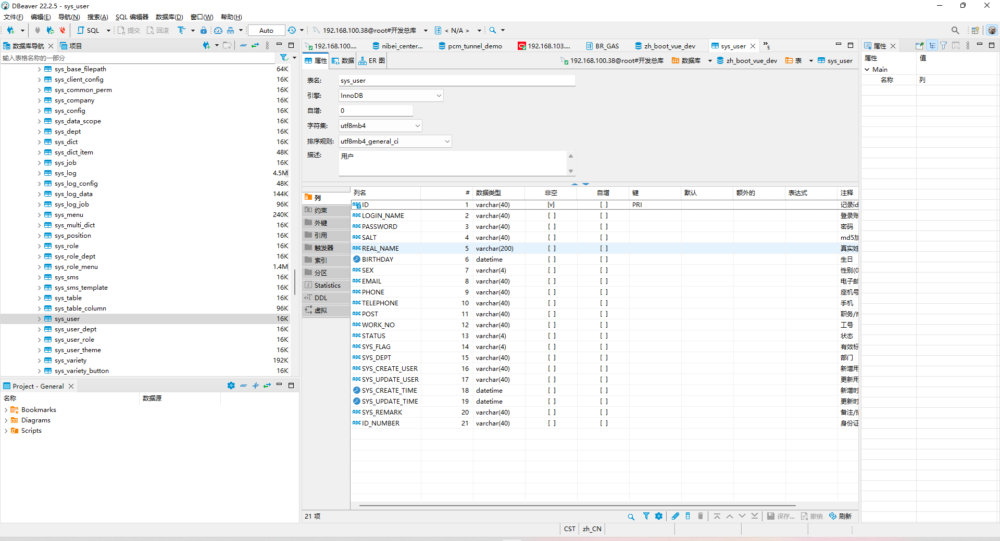
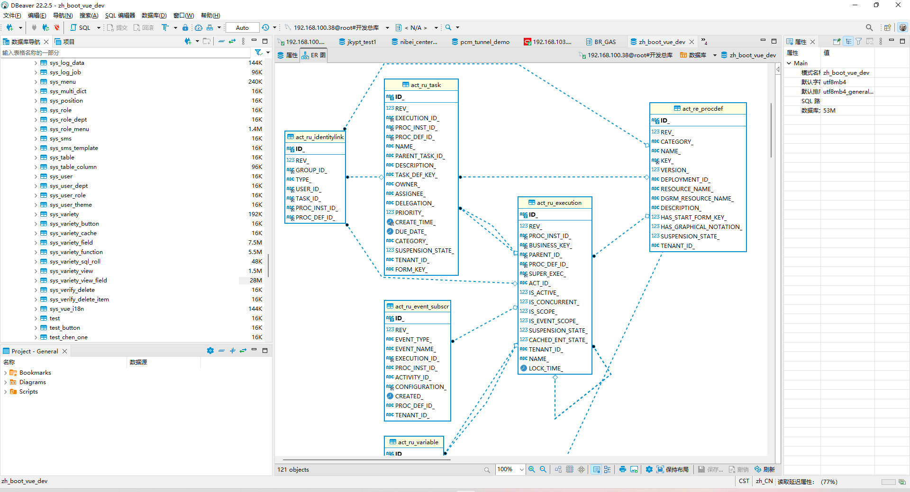
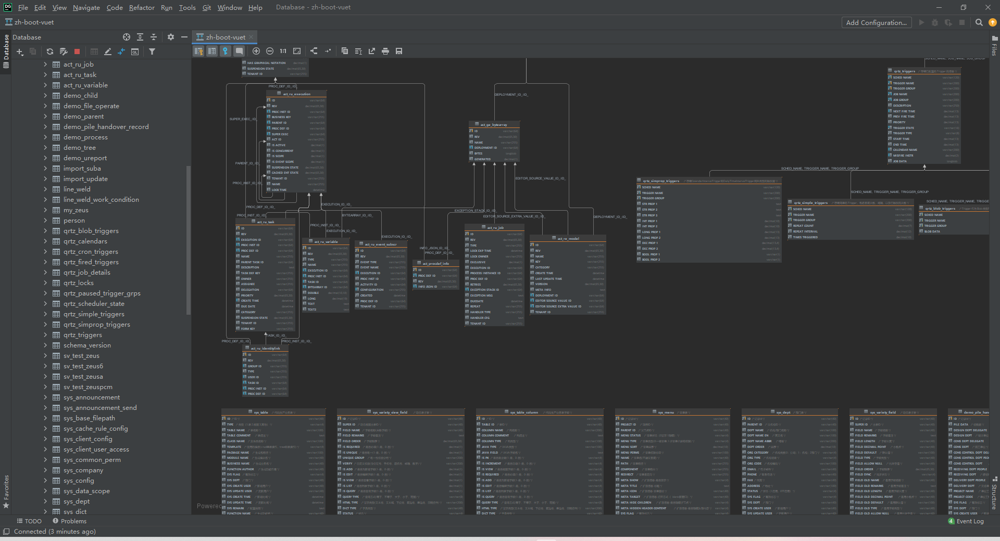
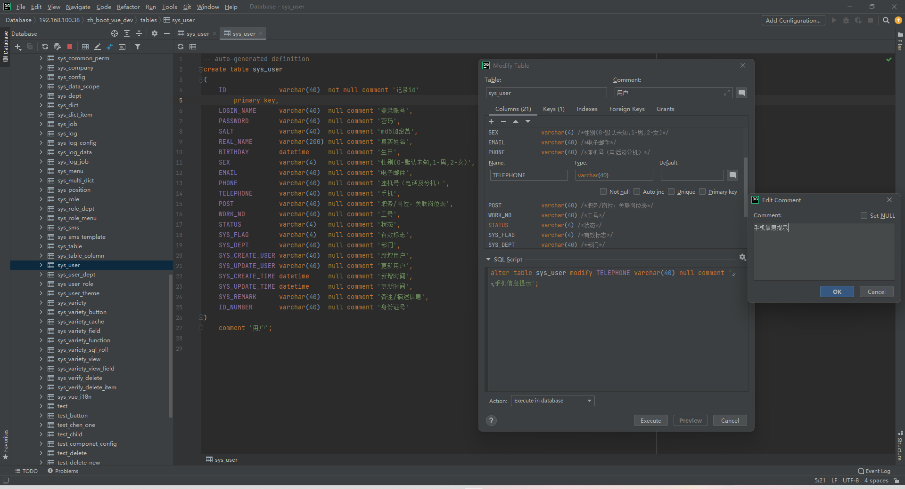
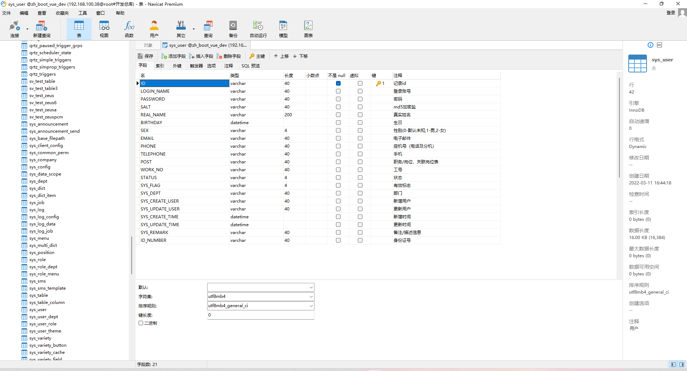
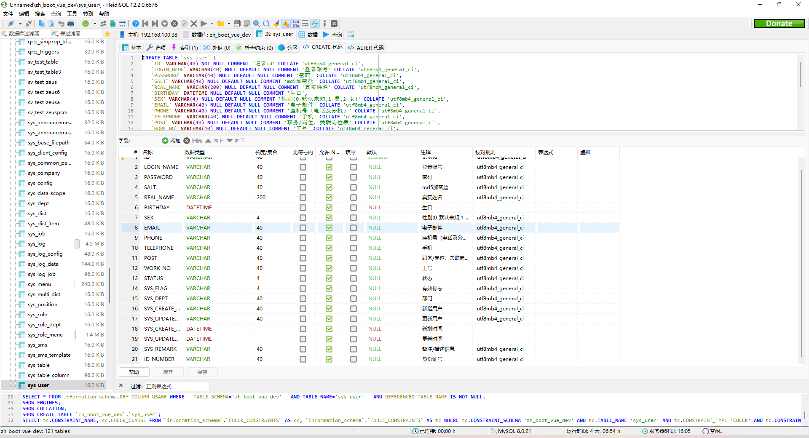
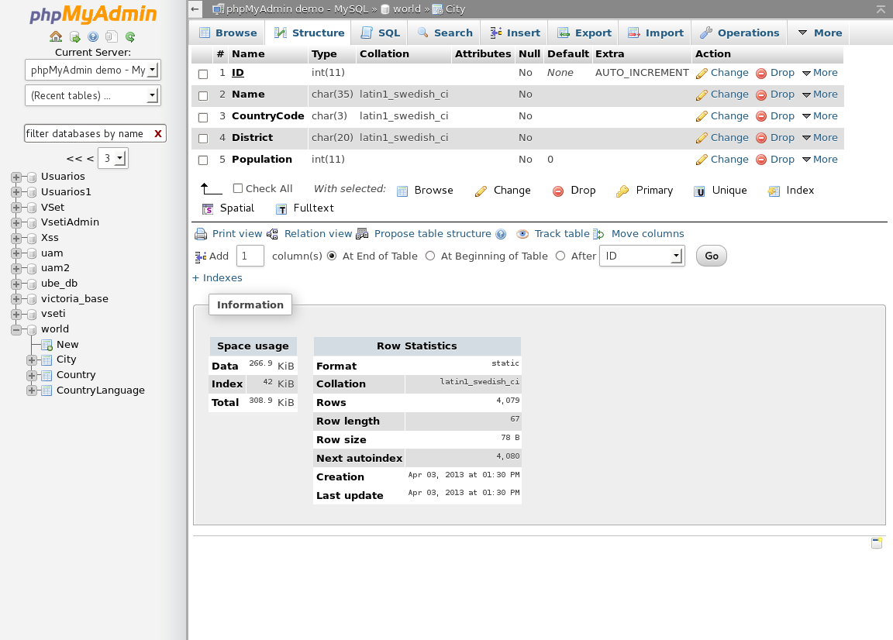

## DBeaver(推荐)

+ 是否免费: 免费开源社区版 及 商业版
+ 下载地址: https://dbeaver.io
+ 支持数据库
  + MySQL
  + PostgreSQL
  + Oracle
  + SQLite
  + SQL Server
  + MariaDB
  + DB2 LUW
  + DuckDB
  + Apache Hive
  + DM: 使用JDBC连接设置可以连接达梦数据库! [使用手册](https://blog.csdn.net/u012063422/article/details/123759444)
  + MongoDB、Redis 为商业版支持的数据库连接
  + 商业版支持更多 NoSQL 数据库 及 更多其他连接数据库
+ 其他常用功能
  + 支持导入navicat数据库连接(密码需要重新输入、各类连接分别单独导入)
  + 数据库结构比较
  + 数据库（结构 & 数据）导入导出
  + ER 图、模拟数据生成(商业版本)
  + ~~无数据传输功能~~
  + 数据库仪表盘(traffic、InnoDB data、Queries、Server sessions)
+ 其他特点或问题
  + 第一次连接新数据库类型时会自动下载对应的驱动
+ 评价: 功能丰富，数据库连接可扩展性好(使用jdbc连接方便)
+ 应用截图





### DBeaver查看本地保存密码

+ 存储文件位置 `首选项 > 常规 > 工作空间`
+ 找到加密文件 `<workspace>\General\.dbeaver\credentials-config.json`
+ 解密数据
  + -K 参数参考源码 `https://github.com/dbeaver/dbeaver/blob/6.3.5/plugins/org.jkiss.dbeaver.model/src/org/jkiss/dbeaver/model/impl/app/DefaultSecureStorage.java`

```shell
openssl aes-128-cbc -d \
  -K babb4a9f774ab853c96c2d653dfe544a \
  -iv 00000000000000000000000000000000 \
  -in credentials-config.json | \
  dd bs=1 skip=16 2>/dev/null
```

## DataGrip

+ 是否免费: jetbrains系列商业软件
+ 下载地址: https://www.jetbrains.com/datagrip/download/other.html
+ 支持数据库
  - MySQL
  - PostgreSQL
  - Oracle
  - SQLite
  - SQL Server
  - MariaDB
  - MongoDB
  - Apache Hive
  - DM: 使用JDBC连接设置可以连接达梦数据库! [使用手册](https://wangjueya.github.io/datagrip-lian-jie-da-meng-shu-ju-ku)
  - **elasticsearch**
+ 其他常用功能
  - 数据库结构比较(UI美观)
  - 数据库（结构 & 数据）导入导出
  - 模型映射 Diagrams Show Visualization 
+ 其他特点或问题
  + 提供多数据库驱动
  + 拥有智能的上下文敏感和编码语法提示
  + 拥有可视化的表格编辑，你可以添加、删除、编辑和克隆数据行
  + 提供版本控制支持
  + 重构支持（主要是会给你SQL优化的建议，使你能够重构sql）
  + 内存占用过大、安装包过大
  + 第一次连接新数据库类型时会自动下载对应的驱动
  + 没有可视化表结构设计，偏向编码式表结构修改 - 无数据库字段提示
+ 评价: 功能丰富多样, 不够轻量
+ 应用截图





## Navicat Premium

+ 是否免费: 仅免费试用期
+ 下载地址: http://www.navicat.com.cn/download/navicat-premium
+ 支持数据库
  + MySQL
  + PostgreSQL
  + Oracle
  + SQLite
  + SQL Server
  + MariaDB
  + MongoDB
  + ~~DM~~
  + 其他常用云数据库(Amazon AWS、Oracle Cloud、Microsoft Azure、MongoDB Cloud Services、阿里云、腾讯云、华为云)
+ 其他常用功能
  + 数据传输、数据同步
  + 数据库（结构 & 数据）导入导出
  + 模型设计 & 逆向表到模型
+ 评价: 界面简单，功能强大，使用方便
+ 应用截图



## HeiDiSQL

- 是否免费: 免费使用
- 下载地址: https://www.heidisql.com/download.php
- 支持数据库
  - Mysql
  - ProxySQL Admin
  - SQL Server
  - PostgreSQL
  - SQLite
  - Firebird
- 其他特点或问题
  - 用户量少，社区不活跃
- 评价: 功能较少，比较轻量
- 应用截图



## ~~phpMyAdmin~~

+ 是否免费: 免费使用
+ 下载地址: https://www.phpmyadmin.net
+ 支持数据库
  + 关系型数据库
+ 其他特点或问题
  + 通过网页操作数据库
+ 评价: 开发应用性不高
+ 应用截图



## 数据库测试地址

| 名称  | 连接池地址 | 用户名 |
| ----- | ---------- | ------ |
| mysql | jdbc:mysql://192.168.100.38:3306/zh-boot-vuet | root |
|oracle |jdbc:oracle:thin:@//192.168.103.200:1521/szp6|ZHBOOT_VUE_DEV|
|postgres|jdbc:postgresql://192.168.100.21:5432/test_db|test_user|
|MongoDB|jdbc:mongodb://192.168.100.21:27017/yushan|yushan|
|DM|jdbc:dm://192.168.103.116:5236/JYCK_MANAGER|JYCK_MANAGER|
