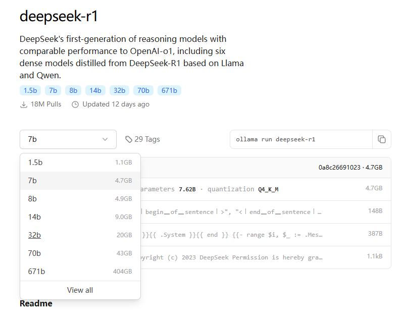

## 参数模型显卡要求

模型运行参数要求



+ [deepseek模型下载](https://ollama.com/library/deepseek-r1)

### 模型尺寸选择

不同尺寸的模型区别主要体现在参数规模、模型容量、性能表现、准确性、训练成本、推理成本和不同使用场景

| DeepSeek模型版本     | 参数量  | 特点                         | 适用场景                                                               | 硬件配置                                      |
|------------------|------|----------------------------|--------------------------------------------------------------------|-------------------------------------------|
| DeepSeek-R1-1.5B | 1.5B | 轻量级模型，参数量少，模型规模小           | 适用于轻量级任务，如短文本生成、基础问答等                                              | 4核处理器、8G内存，无需显卡                           |
| DeepSeek-R1-7B   | 7B   | 平衡型模型，性能较好，硬件需求适中          | 适合中等复杂度任务，如文案撰写、表格处理、统计分析等                                         | 8核处理器、16G内存，Ryzen7或更高，RTX 3060（12GB）或更高   |
| DeepSeek-R1-8B   | 8B   | 性能略强于7B模型，适合更高精度需求         | 适合需要更高精度的轻量级任务，比如代码生成、逻辑推理等                                        | 8核处理器、16G内存，Ryzen7或更高，RTX 3060（12GB）或4060 |
| DeepSeek-R1-14B  | 14B  | 高性能模型，擅长复杂的任务，如数学推理、代码生成   | 可处理复杂任务，如长文本生成、数据分析等                                               | i9-13900K或更高、32G内存，RTX 4090（24GB）或A5000   |
| DeepSeek-R1-32B  | 32B  | 专业级模型，性能强大，适合高精度任务         | 适合超大规模任务，如语言建模、大规模训练、金融预测等                                         | Xeon 8核、128GB内存或更高，2-4张A100（80GB）或更高      |
| DeepSeek-R1-70B  | 70B  | 顶级模型，性能最强，适合大规模计算和高复杂任务    | 适合高精度专业领域任务，比如多模态任务预处理。这些任务对硬件要求非常高，需要高端的 CPU 和显卡，适合预算充足的企业或研究机构使用 | Xeon 8核、128GB内存或更高，8张A100/H100（80GB）或更高   |
| DeepSeek-R1-671B | 671B | 超大规模模型，性能卓越，推理速度快，适合极高精度需求 | 适合国家级 / 超大规模 AI 研究，如气候建模、基因组分析等，以及通用人工智能探索                         | 64核、512GB或更高，8张A100/H100                  |

## 部署推荐

## 大模型训练场景

| 模型训练场景 | 总体要求 |  所需数据量   |     质量要求     |
|:------:|:----:|:--------:|:------------:|
|  预训练   |  超高  |  不低于2T   |    通用领域数据    |
|  持续训练  |  高   | 数十到数百B级别 |    通用领域数据    |
|   微调   |  中   | 数十万到数千万  | 高质量垂直行业专业知识  |
| 数据库外挂  |  中   |    按需    | 行业专业知识、规范化格式 |
| 提示词工程  |  低   |    按需    |    提示样例数据    |

## 数据集下载

### 一、通用数据平台

#### 1. **Kaggle**

* **网址**: <https://www.kaggle.com/datasets>

* **特点**: 社区活跃，数据集涵盖金融、医疗、社交网络等领域，支持直接下载或通过API调用。

* **示例数据集**:

    * [COVID-19开放数据集](https://www.kaggle.com/allen-institute-for-ai/CORD-19-research-challenge)
    * [Titanic乘客数据](https://www.kaggle.com/c/titanic/data)

#### 2. **Hugging Face Datasets**

* **网址**: <https://huggingface.co/datasets>

* **特点**: 专注于NLP和多模态数据集，提供标准化加载接口（`datasets`库）。

* **示例数据集**:

    * GLUE（自然语言理解基准）: `load_dataset("glue", "mrpc")`
    * Common Voice（多语言语音）: `load_dataset("common_voice", "en")`

#### 3. **UCI Machine Learning Repository**

* **网址**: <https://archive.ics.uci.edu/ml/index.php>

* **特点**: 经典数据集集合，适合机器学习入门与实验。

* **示例数据集**:

    * Iris（鸢尾花分类）: [下载链接](https://archive.ics.uci.edu/ml/datasets/iris)
    * Adult（人口收入预测）: [下载链接](https://archive.ics.uci.edu/ml/datasets/adult)

***

### 二、自然语言处理（NLP）

#### 1. **文本语料库**

* **Wikipedia Dump**

    * **下载**: <https://dumps.wikimedia.org>
    * **用途**: 预训练语言模型（如BERT、GPT）。

* **BookCorpus**
    * **下载**: 需通过学术申请或第三方镜像（如[TensorFlow Datasets](https://www.tensorflow.org/datasets)）。

#### 2. **任务特定数据集**

* **SQuAD（问答）**:
    * **下载**: <https://rajpurkar.github.io/SQuAD-explorer/>
* **CoNLL-2003（命名实体识别）**:
    * **下载**: [Hugging Face Datasets](https://huggingface.co/datasets/conll2003)
* **OpenWebText（开源版WebText）**:
    * **下载**: [GitHub仓库](https://github.com/jcpeterson/openwebtext)

***

### 三、计算机视觉（CV）

#### 1. **图像分类**

* **ImageNet**

    * **下载**: 需注册并申请访问权限 [ImageNet官网](http://www.image-net.org)
    * **替代方案**: 使用`torchvision.datasets.ImageNet`（需本地路径）。

* **CIFAR-10/100**:
    * **下载**: 直接通过深度学习框架加载（如PyTorch）：
      ```python
      import torchvision.datasets as datasets
      cifar10 = datasets.CIFAR10(root='./data', download=True)
      ```

#### 2. **目标检测与分割**

* **COCO（Common Objects in Context）**:
    * **下载**: <https://cocodataset.org>
* **PASCAL VOC**:
    * **下载**: <http://host.robots.ox.ac.uk/pascal/VOC>

#### 3. **图像生成**

* **FFHQ（Flickr-Faces-HQ）**:
    * **下载**: [Google Drive](https://drive.google.com/drive/folders/1u3xuSvE3B3E8JgGKB7C_BfY8_T3u6l4K)
* **LAION-5B（大规模多模态）**:
    * **下载**: 通过Hugging Face <https://laion.ai/blog/laion-5b/>

***

### 四、语音与音频

#### 1. **LibriSpeech**

* **下载**: <http://www.openslr.org/12>
* **用途**: 语音识别模型训练（如Whisper）。

#### 2. **Mozilla Common Voice**

* **下载**: <https://commonvoice.mozilla.org>
* **特点**: 多语言开源语音数据集，支持社区贡献。

***

### 五、推荐系统与图数据

#### 1. **MovieLens**

* **下载**: <https://grouplens.org/datasets/movielens>
* **规模**: 从1M到25M评分数据可选。

#### 2. **Amazon Product Data**

* **下载**: <https://nijianmo.github.io/amazon/index.html>
* **内容**: 商品评论、元数据、社交网络图。

#### 3. **OpenStreetMap（地理数据）**

* **下载**: <https://www.openstreetmap.org>

***

### 六、其他工具与技巧

#### 1. **批量下载方法**

* **wget/curl**:
  ```bash
  wget -i list_of_urls.txt  # 批量下载URL列表中的文件
  ```
* **rsync（大型数据集）**:
  ```bash
  rsync -avz username@server:/path/to/dataset ./local_dir
  ```

#### 2. **数据许可协议检查**

* **CC-BY（署名）**、**CC0（公共领域）**、**Apache/MIT（代码兼容）** 等协议需根据用途合规使用。

#### 3. **数据预处理工具**

* **Pandas（表格数据）**: 清洗、转换。
* **Spark（大规模数据）**: 分布式处理。
* **Albumentations（图像增强）**: 实时数据增强。

***

### 七、注意事项

1. **数据偏见**: 检查数据集的代表性（如性别、地域分布）。
2. **存储与计算**: 大规模数据集（如LAION-5B）需TB级存储与GPU集群支持。
3. **版本管理**: 使用`DVC（Data Version Control）`跟踪数据集版本。

***

通过上述资源，可快速获取适用于大模型训练的开源数据集。建议根据任务需求选择数据规模适中、标注质量高的数据集，并优先参考学术论文中的基准数据集以复现结果。

## 参考链接

+ [deepseek-r1的1.5b、7b、8b、14b、32b、70b和671b有啥区别？](https://www.mabiji.com/deepseek/deepseekr115b7b8b14b32b70b671b.html)\
+ [阿里云：一键部署DeepSeek-V3、DeepSeek-R1模型](https://help.aliyun.com/zh/pai/user-guide/one-click-deploy-deepseek)
+ [腾讯云: DeepSeek-R1大模型一键部署教程by腾讯云HAI，如此简单！](https://www.mabiji.com/deepseek/txyhai.html)