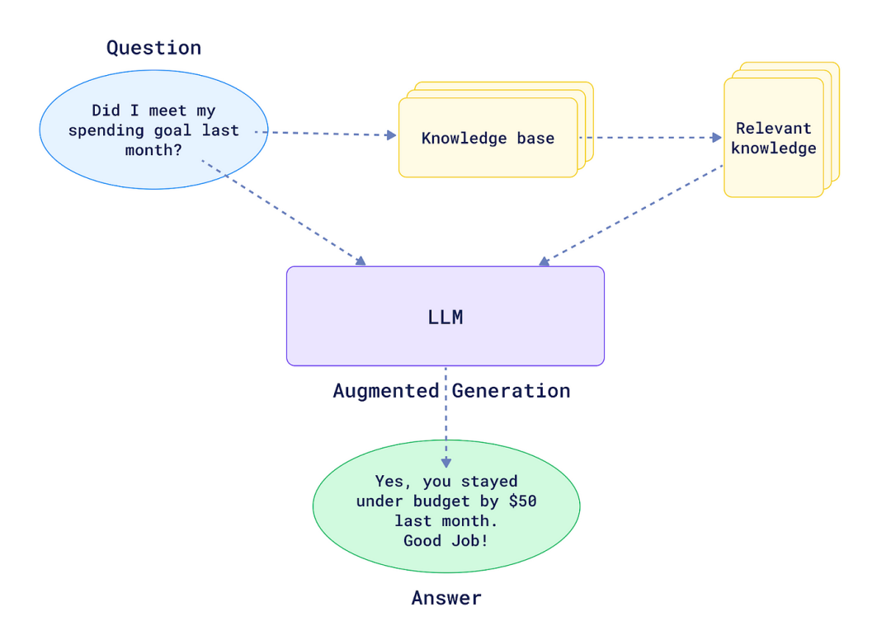

## 背景

检索增强生成（Retrieval Augmented Generation），简称 RAG 主要用于解决 知识的局限性、幻觉问题、数据安全性等问题的。
简单来讲，RAG就是通过检索获取相关的知识并将其融入Prompt，让大模型能够参考相应的知识从而给出合理回答。

完整的RAG应用流程主要包含两个阶段：

数据准备阶段：数据提取——>文本分割——>向量化（embedding）——>数据入库
应用阶段：用户提问——>数据检索（召回）——>注入Prompt——>LLM生成答案

## RAG架构选型

# https://zhuanlan.zhihu.com/p/16138803604

|            模型名称             |                   项目仓库                    |
|:---------------------------:|:-----------------------------------------:|
|          Haystack           |      github.com:deepset-ai/haystack       |
|            MaxKB            |        github.com:1Panel-dev/MaxKB        |
|           RAGFlow           |       github.com:infiniflow/ragflow       |
|            Txtai            |          github.com:neuml/txtai           |
|            STORM            |      github.com:stanford-oval/storm       |
|           LLM-App           |       github.com:pathwaycom/llm-app       |
|           Cognita           |      github.com:truefoundry/cognita       |
| R2R（Retrieval-to-Retrieval） |     git@github.com:SciPhi-AI/R2R.git      |
|           Neurite           |   github.com:satellitecomponent/Neurite   |
|          FlashRAG           |       github.com:RUC-NLPIR/FlashRAG       |
|           Canopy            |       github.com:pinecone-io/canopy       |
|    langchain4j-aideepin     | github.com:moyangzhanlangchain4j-aideepin |
|        jai-workflow         |    github.com:czelabueno/jai-workflow     |
|          OpenManus          |     github.com:mannaandpoem/OpenManus     |

## 参考链接

+ [RAG框架总结主流框架](https://juejin.cn/post/7442301465249382419)
+ [浏览器助手](https://github.com/browser-use/browser-use)
+ [多智能体架构](https://mp.weixin.qq.com/s/F0JF-P2b8hT8Pjyer08gpg)