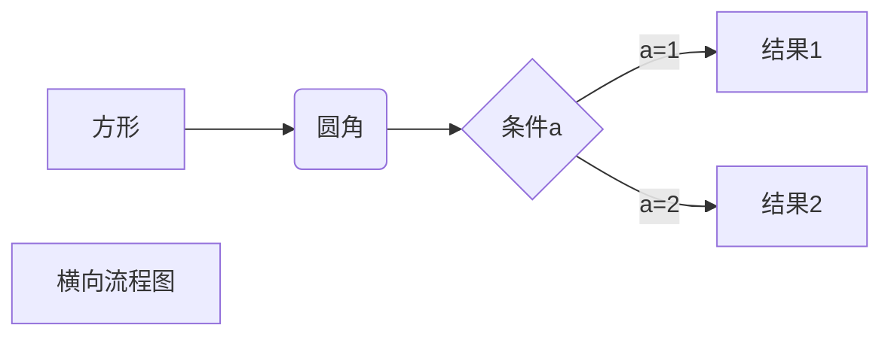
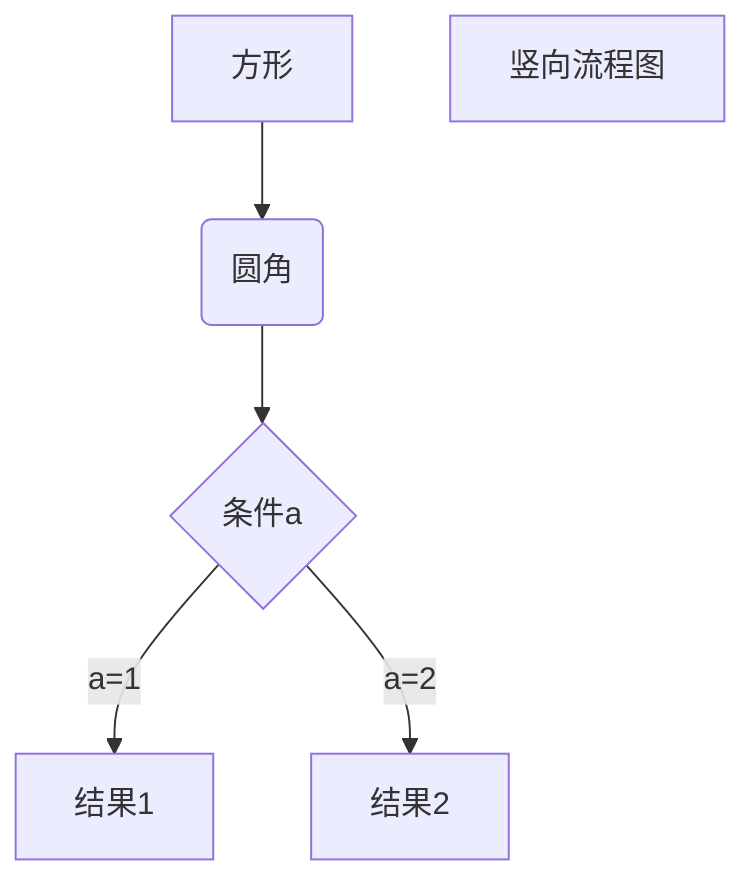
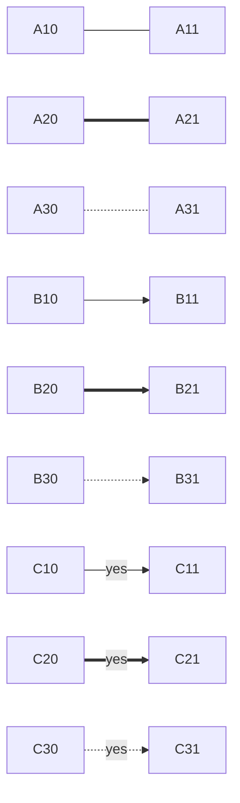
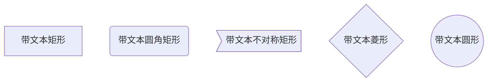

# CMD

## 关闭java进程

```
netstat -aon|findstr "8080"
taskkill -PID 8372 -F
```

## 控制面板-卸载程序

```
appwiz.cpl
```

## 刷新DNS缓存

```
ipconfig /flushdns
```

# IDEA

## 不能输入中文

```
1. 点击菜单 "Help | Edit Custom VM options..."
2. 添加 -Drecreate.x11.input.method=true 到最后一行
```

## 整合leetcode edit

> CodeFileNam

```
$!velocityTool.camelCaseName(${question.titleSlug})/$!velocityTool.camelCaseName(${question.titleSlug})
```

> CodeTemplate

```
${question.content}

package com.jue.java.learn.leetcode.editor.cn.$!velocityTool.camelCaseName(${question.titleSlug});

/**
 * @author JUE
 * @number ${question.frontendQuestionId}
 */

public class $!velocityTool.camelCaseName(${question.titleSlug}) {
    public static void main(String[] args) {
        Solution solution = new Solution();
    }
}

${question.code}
```

```PlantUML integration ```

# markdown

## 特殊符号

··· # 一级标题 ’#‘ ···

··· ###### 六级标题 ’######‘ ···

*斜体* ’* *‘

**加粗** ’** **‘

***斜体加粗***  '*** ***'

~~删除线~~ ’~~ ~~‘

> 引用 '>'

---

***

分割线 --- ***

图片 ! [ 图片alt ] ( 图片地址
“图片title” ) 

## 超链接

超链接 [ 超链接名 ] (超链接地址 “超链接title”)

[leetcode](https://leetcode-cn.com/problemset/all/  “力扣“)

```
<a href="超链接地址" target="_blank">超链接名</a>
```

<a herf="https://leetcode-cn.com/problemset/all/" target="_blank">力扣</a>

无序列表 - + *

- 1
    + 2
        * 3

有序列表 1. 2. 3.

1. a
2. b
3. c

列表嵌套

1. 标题

    * tab

## 表格

|表头|表头|表头|

|-|:-:|-:|

|正常|居中|居右| |||| ||

代码 `代码`

代码块 ```

````
​```
代码块
​```
````

## 流程图

横向流程图



竖向流程图



普通流程图

```flow
st=>start: 开始框
op=>operation: 处理框
cond=>condition: 判断框(是或否?)
sub1=>subroutine: 子流程
io=>inputoutput: 输入输出框
e=>end: 结束框
st->op->cond
cond(yes)->io->e
cond(no)->sub1(right)->op
```

UML时序图源码样例：

```sequence
对象A->对象B: 对象B你好吗?（请求）
Note right of 对象B: 对象B的描述
Note left of 对象A: 对象A的描述(提示)
对象B-->对象A: 我很好(响应)
对象A->对象B: 你真的好吗？
```





# regular

## 常用实例

### 匹配第10次出现的逗号

```
(([^,]*,){10})
```

```
VALUES ('0001PlatParent', '0001', NULL, '1', '0', '-1', NULL, 'plat', '/plat', 'PlatBasicLayout', NULL, 'N', '大屏菜单(固定位于首位)', 'home', NULL, 'N', 'N', NULL, NULL, NULL, NULL, NULL, NULL, NULL);

VALUES (([^,]*,){12})(([^\']*\'){1})([^\']*)

VALUES $1 '{"zh-CN":"$5","en-US":"welcome"}

```
