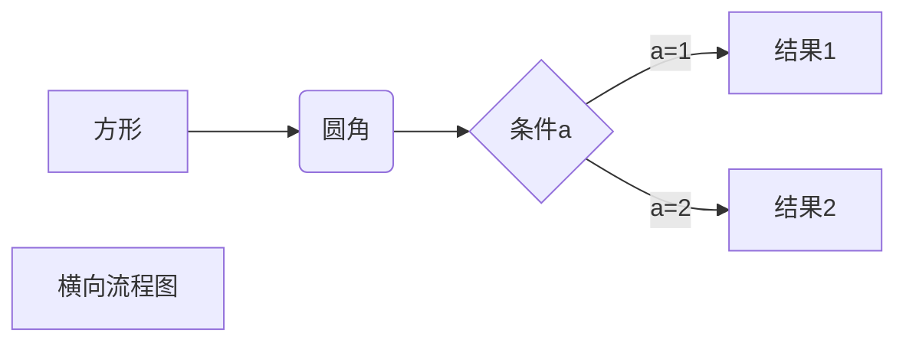
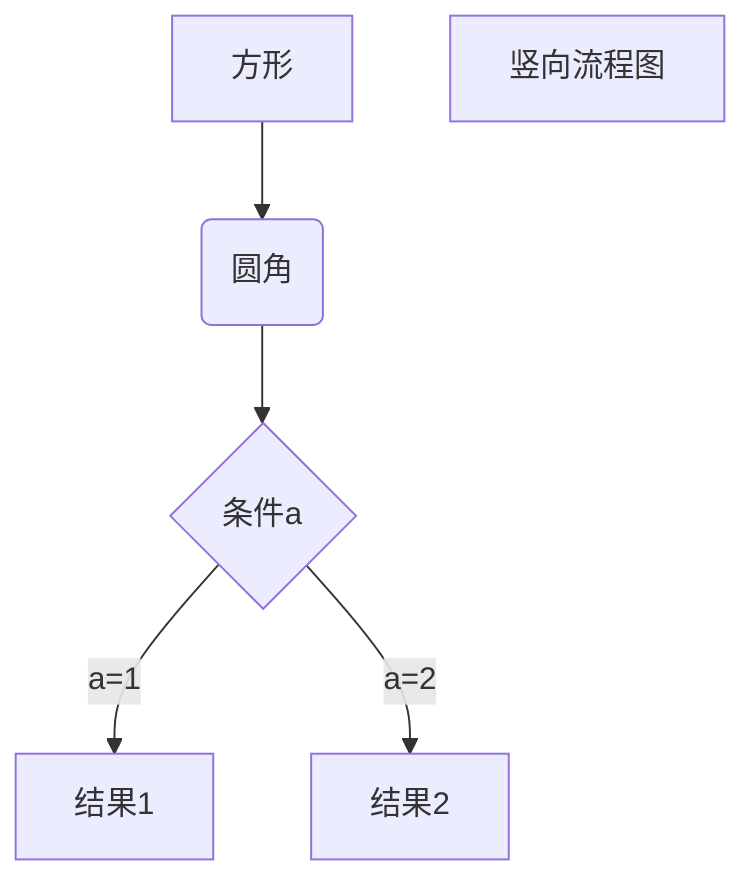

# 一级标题 ’#‘

###### 六级标题 ’######‘

*斜体* ’* *‘

**加粗** ’** **‘

***斜体加粗***  '*** ***'

~~删除线~~ ’~~ ~~‘

> 引用 '>'

---

***

分割线 --- ***

图片 ! [ 图片alt ] ( 图片地址
“图片title” ) 

超链接 [ 超链接名 ] (超链接地址 “超链接title”)

[leetcode](https://leetcode-cn.com/problemset/all/  “力扣“)

```
<a href="超链接地址" target="_blank">超链接名</a>
```

<a herf="https://leetcode-cn.com/problemset/all/" target="_blank">力扣</a>

无序列表 - + *

- 1
    + 2
        * 3

有序列表 1. 2. 3.

1. a
2. b
3. c

列表嵌套

1. 标题

    * tab

表格

|表头|表头|表头|

|-|:-:|-:|

|正常|居中|居右| |||| ||

代码 `代码`

代码块 ```

```
​```
代码块
​```
```

流程图 横向流程图



竖向流程图



普通流程图

```flow
st=>start: 开始框
op=>operation: 处理框
cond=>condition: 判断框(是或否?)
sub1=>subroutine: 子流程
io=>inputoutput: 输入输出框
e=>end: 结束框
st->op->cond
cond(yes)->io->e
cond(no)->sub1(right)->op
```

UML时序图源码样例：

```sequence
对象A->对象B: 对象B你好吗?（请求）
Note right of 对象B: 对象B的描述
Note left of 对象A: 对象A的描述(提示)
对象B-->对象A: 我很好(响应)
对象A->对象B: 你真的好吗？
```


