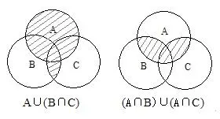

## 数学运算
### 计算问题

#### 算式计算

|常用法则|具体公式|
|:---:|:---:|
|加法|$ a+b=b+a, (a+b)+c=a+(b+c) $|
|乘法|$ a\times{b}=b\times{a}, (a\times{b})\times{c}=a\times{(b\times{c})} $|
|幂次|$ a^{m}\times{a^{n}}=a^{n}\times{a^{m}}=a^{m+n}, (a^m)^n=(a^n)^m=a^{mn}, (a\times{b})^m=a^m\times{b^m}, (\frac ba)^m=\frac {b^m} {a^m} $|
|完全平方公式|$ (a\pm b)^2=a^2\pm 2ab+b^2 $|
|平方差公式|$ a^2-b^2=(a+b)(a-b) $|
|完全立方公式|$ (a\pm b)^3 = a^3\pm 3a^2b+3ab^2+b^3 $|
|立方和(差公式)|$ a^3\pm b^3=(a\pm b)(a^2\mp ab+b^2) $|
|列项公式|$ \frac {d} {n(n+d)}=\frac 1n - \frac{1}{n+d}, 当d=1时, \frac{1}{n(n+1)}=\frac 1n-\frac{1}{n+1} $|

#### 数列计算

|数列|通项公式|对称公式|求和公式|
|:---:|:---:|:---:|:---:|
|等差数列|$a_n=a_1+(n-1)d$|$a_m+a_n=a_i+a_j, 其中m+n=n+j$|$①一般求和: S_n=\frac {n(a_1+a_n)} {2}=na_1+\frac 12n(n-1)d \\\\ ②中项求和: S_n=\begin{cases} na_{\frac{n+1}{2}} , n为奇数 \\\\ \frac n2(a_{\frac n2}+a_{\frac n2 + 1}) , n为偶数 \end{cases}$|
|等比数列|$a_n=a_1·q^{n-1}$|$a_m·a_n=a_i·a_j, 其中 m+n=i+j$|$S_n=\begin{cases} \frac{a_1(1-q^n)}{1-q}, q \neq 1 \\\\ na_1, q = 1 \end{cases}$|
|平方数列|$a_n=n^2$||$S_n=\frac 16 n(n+1)(2n+1)$|
|立方数列|$a_n=n^3$||$S_n=\[\frac 12 n(n+1)]^2$|

+ 平方数列利用 $(n+1)^3-n^3=3n^2+3n+1$ 多项式求和
+ 立方数列利用 $(n+1)^4-n4=4n^3+6n^2+4n+1$ 多项式求和

#### 平均数与均值不等式
|分类| 概念及公式 |
|:---:|:---:|
| 算术平均数 |所有数据之和除以数据个数所得的商，用公式表示为 $ M=\frac {m_1+m_2+m_3+ \cdots +m_n}{n} $|
| 加权平均数 |比重不同的一组数据的平均数，即把原始数据按照合理的比例来计算。 在一组数据中,$ x_1、x_2、x_3、\cdots、x_k $ 出现的次数分别为 $ f_1、f_2、f_3、\cdots、f_k $ ， 且 $ f_1+f_2+f_3+ \cdots +f_k=n $， 那么这组数据的加权平均数 $ \overline X = \frac {x_1 \cdot f_1 + x_2 \cdot f_2 + \cdots + x_k \cdot f_k} {f_1+f_2+f_3+ \cdots +f_k} = \frac {x_1 \cdot f_1 + x_2 \cdot f_2 + \cdots + x_k \cdot f_k} {n} $|
| 几何平均数 |几个正实数乘积的n次算术根，用公式表示为 $ G=\sqrt\[n]{m_1 \cdot m_2 \cdot m_c \cdot \cdots \cdot m_n} $|
| 圴值不等式 |任意几个正数的算术平均数总是不小于其几何平均数。即 $ \frac {m_1+m_2+m_3+ \cdots +m_n}{n} \geqslant \sqrt \[n] {m_1 \cdot m_2 \cdot m_c \cdot \cdots \cdot m_n} $ ，当且仅当 $ m_1=m_2=m_3= \cdots =m_n $ 时，等号成立。|

+ 公务员考试多考查两个数或三个数的均值不等式：

$ ① \frac {a+b}{2} \geqslant \sqrt{ab}, 当且仅当 a=b 时等号成立；$

$ ② \frac {a+b+c}{2} \geqslant \sqrt\[3]{abc}, 当且仅当 a=b=c 时等号成立。$

#### 比较大小
常用的比较大小的方法有**作差法**、**作商法**、**倒数法**和**中间值法**。

#### 定义新运算
解定义新运算问题，只需将新定义的运算规则转化为常规的四则运算即可。

### 和差倍比问题

#### 和差倍问题

和差倍问题的解题关键在于“1倍量”的计算，考生要正确理解题意。情况比较复杂时，可采用方程 法简化思路。

和差倍问题可分为如下三类：


- 分类
  - 和倍关系
    - 和 ÷ (倍数+1)=小数 
    - 小数x倍数=大数
  - 差倍关系
    - 差 ÷ (倍数-1)=小数
    - 小数x倍数=大数
  - 和差关系
    - (和+差)-2=大数
    - (和-差)-2=小数


#### 比例问题

核心公式：分量 ÷ 总量 = 所占比例、分量 ÷ 所占比例 = 总量。

解题关键：比例问题的解题关键是找准各分量、总量及两者之间的比例关系。当题干涉及两个数的比，日这两个数必须为整数时。可运用数字特征对选项进行筛选，即排除法。分数、百分数皆适用。

#### 连比问题

在数学运算中，连比问题的题干多是给出三个已知量中任意两个比例式，可通过对两个比例式的转化得到三个量的比例关系。

解题关键：连比问题可通过找最小公倍数，直接确定答案。

### 行程问题

+ 行程问题的研究核心是物体运动过程中速度、时间和路程三者之间的关系。
#### 行程问题的基础知识

核心公式：路程=时间x速度。

比例关系：时间相同，速度比=路程比；速度相同，时间比=路程比; 路程相同，速度比=时间反比。

平均速度：平均速度=总路程÷总时间。

若物体前一半时间以速度$v_1$运动，后一半时间以速度$v_2$运动,则全程的平均速度为$\frac {v_1+v_2}{2}$

若物体前一半路程以速度$v_1$运动，后一半路程以$v_2$运动，则全程的平均速度为$\frac {2v_1v_2}{v_1+v_2}$

#### 行程问题的基本类型

常见的行程问题核心考点及相关公式如下表所示：

|问题类型|核心考点及相关公式|
|:---:|:---|
|相遇问题|相遇问题主要研究两个物体相向(相对)运动的情况 相遇时间=相遇路程÷速度和|
|追及向题|追及问题主要研究两个物体同向运动的情况 追及时间=追及路程÷速度差|
|往返多次相遇问题|从两地同时出发的直线多次相遇问题中，第 n 次相遇时，每个人走的路程等于他第一次相遇时所走路程的 (2n-1) 倍|
|环线相遇问题|环线相遇向题中每次相遇所走的路程之和是一圈。如果最初从同一点出发，那么第 n 次相遇时，每个人所走的总路程等于第一次相遇时所走路程的 n 倍|
|环线追及问题|环线追及问题中每次相遇所走的路程差是一圈。如果最初从周长为 S 的环形跑道同一点出发,那么第 n 次相遇时，两个人的路程差为 nS|
|流水问题|流水问题主要是研究船在逆水和顺水时的速度差别 顺水速度=船速＋水速;逆水速度=船速-水速 船速=(顺水速度＋逆水速度)÷2;水速=(顺水速度-逆水速度)÷2|
|火车过桥问题|火车在运动过程中，在计算火车走过的路程时，需要将”车长“考虑进来 火车速度x时间=车长+桥长|

### 工程问题

+ 工程问题中涉及工作量、工作时间和工作效率三个量,其核心公式是工作量=工作效率x工作时间。常见的工程问题如下所示


- 工程问题
  - 单独完成工程问题
  - 合作完成工程问题
    - 两人完全合作完工问题
    - 合作＋休息完工问题
    - 三人或多人完工问题
  - 水管问题
    - 单根水管进水
    - 多根水管进水
    - 同时进水出水
  - 解题方法
    - 特值法、方程法
 

+ 水管问题属于工程问题的衍生。当遇到注水问题时，可将注水管的工作效辛视为正，排水管的工作效率视为负;遇到排水问题时,注水管的工作效率为负，排水管的工作效率为正。

### 浓度问题

+ 浓度问题指与溶液浓度相关的问题。题型可分为两种，溶液蒸发或稀释问题以及两种溶液的混合问题，

#### 基本概念

+ 溶剂：溶剂是一种可以溶化固体、液体或气体的物质。日常生活中比较常见的溶剂一般为液体。例如盐水溶液中的水就是溶剂。
+ 溶质：溶质是溶液中被溶剂溶解的物质。例如盐水溶液中的食盐就是溶质。
+ 溶液：溶液是由溶质和溶剂共同组成的混合物。例如食盐溶于水形成的混合物为盐水溶液。
+ 浓度：我们日常生活以及公务员考试中所涉及的浓度一般指的是质量百分浓度，即溶液中所含溶质质量与溶液质量的百分比。

#### 基本公式

+ 溶液质量=溶质质量+溶剂质量
+ 浓度=溶质质量-溶液质量×100%

#### 溶液的混合特性

+ 一种高浓度的溶液 A 和一种低浓度的同种溶液 C 混合后得到溶液 B，那么溶液 B 的溶度肯定介于溶液 A 和溶液 C 的浓度之间。

### 利润问题

#### 概念及相关公式

利润问题相关概念及公式如下所示：

|概念 |含义 | 示例 | 相关公式|
|:---:|:---|:---|:---|
|进价 |商品买进的价格| 商家以每件 100 元买人某商品||
|定价 |商家根据进价定出的商品出售价格|商家决定以每件 150 元卖出某商品||
|售价 |商品实际的出售价格|商家实际以每件 120 元卖出某商品||
|利润 |售价与进价的差|每件商品商家赚了 120-100=20 元|利润=售价-进价|
|利润率 |利润占进价的百分比|利润率为 20÷100=20%|$利润率= \frac {利润}{进价} $|

#### 主要题型

+ 简单获利问题：题目内容都与进价、售价和利润有关，主要利用相关公式解决问题。
+ 打折问题：商家确定价格之后，为吸引更多顾客购买商品，通常采用打折的方式降低实际价格。
+ 价格与销量反向变化问题：当商品价格上涨时,销量就会下降;价格下跌时，销量就会增加。在公务员考试中,研究此类问题，一般是求总利润最高时的售价或总利润的最大值
+ 多种促销问题：商家有时会给出多种促销方式，我们需要通过计算，确定最优惠的促销方式。

### 容斥问题

+ 几个集合之间存在交叉关系 ，要求根据其相互关系计算元素个数的问题称为“容斥原理”问题。公务员考试中,多涉及两个集合或三个集合。
+ 容斥问题的常用解题方法有公式法和文氏图法两种。

#### 公式法
 + 两个集合：$A \cup B = A+B-A \cap B$
 + 三个集合：$A \cup B \cup C=A+B+C-A \cap B-B \cap C-C \cap A+A \cap B \cap C$
 注意：计算时要找准集合的对应关系及公式中各项的对应数值

#### 文氏图法

当题目关系较为复杂时，可考虑画文氏图，帮助看清各集合之问的关系。如下所示：

### 抽屉问题
### 时钟问题
### 分段计价问题
### 年龄问题
### 日期问题
### 植树问题
### 方阵问题
### 盈亏问题
### 鸡兔同笼问题
### 牛吃草问题
### 几何问题
### 排列组合与概率问题
### 统筹问题
### 推理问题

## 数学推理
### 等差数列及其变式
### 等比数列及其变式
### 和数列及其变式
### 积数列及其变式
### 多次方数列及其变式
### 分式数列
### 组合数列
### 创新数列
### 图形形式数字推理